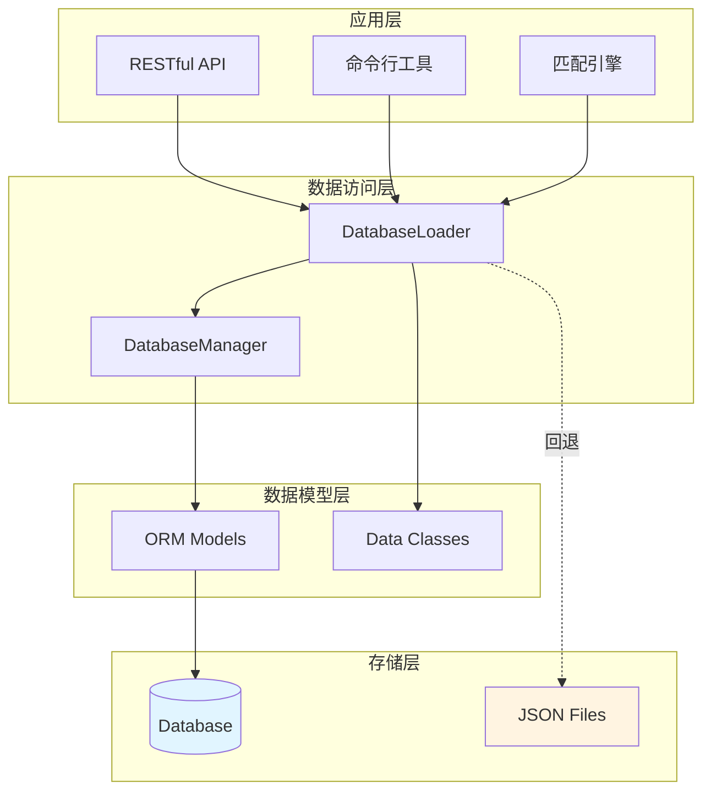
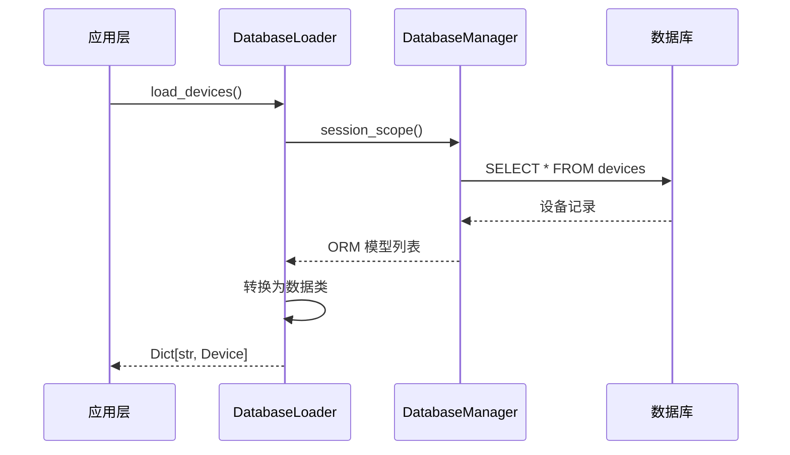
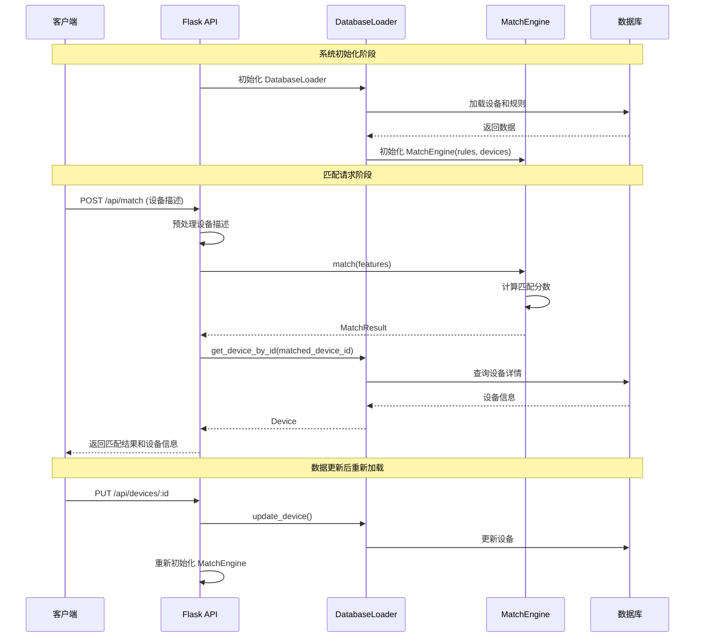
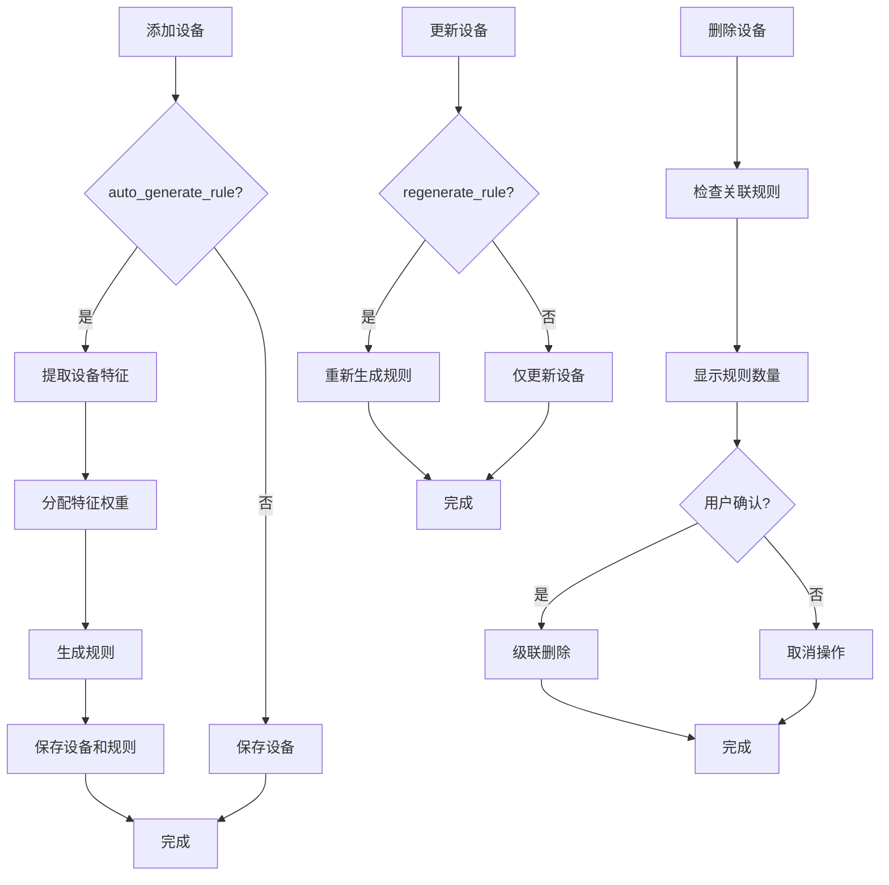

# 设计文档 - 数据库迁移

## 概述

本设计文档描述了将 DDC 设备清单匹配报价系统从静态 JSON 文件存储迁移到关系型数据库存储的技术方案。系统将支持 SQLite 和 MySQL 两种数据库，使用 SQLAlchemy ORM 框架进行数据访问，并保持与现有 JSON 模式的向后兼容性。

### 设计目标

1. **数据持久化**: 使用关系型数据库替代 JSON 文件，支持大规模数据管理
2. **向后兼容**: 保持 JSON 模式可用，支持存储模式切换和自动回退
3. **数据完整性**: 通过外键约束和事务管理确保数据一致性
4. **易用性**: 提供统一的数据访问接口和 RESTful API
5. **可维护性**: 使用 ORM 框架简化数据库操作，提供完整的 CRUD 功能

### 技术栈

- **ORM 框架**: SQLAlchemy 1.4+
- **数据库**: SQLite 3.x（开发/测试）、MySQL 8.0+（生产）
- **Python 版本**: 3.8+
- **Web 框架**: Flask（用于 RESTful API）

## 架构

### 系统架构图



### 存储模式切换机制

系统支持两种存储模式，通过配置文件控制：

1. **JSON 模式** (`STORAGE_MODE=json`): 使用现有的 JSON 文件加载逻辑
2. **数据库模式** (`STORAGE_MODE=database`): 使用新的数据库加载逻辑

当数据库连接失败且 `FALLBACK_TO_JSON=true` 时，系统自动回退到 JSON 模式。

### 数据流



## 组件和接口

### 1. DatabaseManager（数据库管理器）

**职责**: 管理数据库连接、会话和事务

**接口**:

```python
class DatabaseManager:
    def __init__(self, database_url: str, echo: bool = False):
        """初始化数据库连接"""
        
    def create_tables(self) -> None:
        """创建所有数据库表"""
        
    @contextmanager
    def session_scope(self):
        """提供事务会话上下文管理器"""
        
    def get_session(self):
        """获取新的数据库会话"""
        
    def close(self) -> None:
        """关闭数据库连接"""
```

**验证需求**: 1.1, 1.2, 1.3, 1.4, 1.5, 6.1-6.5, 8.2, 8.4

### 2. DatabaseLoader（数据库加载器）

**职责**: 提供数据访问接口，将 ORM 模型转换为数据类

**核心功能**:
1. 数据查询和加载（设备、规则、配置）
2. CRUD 操作（创建、读取、更新、删除）
3. 批量操作支持
4. 数据一致性检查
5. ORM 模型与数据类的双向转换

**接口**:

```python
class DatabaseLoader:
    def __init__(self, db_manager: DatabaseManager, preprocessor=None):
        """
        初始化数据库加载器
        
        Args:
            db_manager: 数据库管理器实例
            preprocessor: 文本预处理器（用于规则生成）
        """
        
    # ========== 查询操作 ==========
    
    def load_devices(self) -> Dict[str, Device]:
        """
        从数据库加载所有设备
        
        Returns:
            设备字典，key 为 device_id
            
        Raises:
            Exception: 数据库查询失败
            
        验证需求: 4.1, 19.1
        """
        
    def load_rules(self) -> List[Rule]:
        """
        从数据库加载所有规则
        
        Returns:
            规则列表
            
        Raises:
            Exception: 数据库查询失败
            
        验证需求: 4.2, 19.2
        """
        
    def get_device_by_id(self, device_id: str) -> Optional[Device]:
        """
        根据 ID 查询单个设备
        
        Args:
            device_id: 设备 ID
            
        Returns:
            设备实例，不存在返回 None
            
        Raises:
            Exception: 数据库查询失败
            
        验证需求: 4.3, 4.5, 19.3
        """
        
    def get_rule_by_id(self, rule_id: str) -> Optional[Rule]:
        """
        根据 ID 查询单个规则
        
        Args:
            rule_id: 规则 ID
            
        Returns:
            规则实例，不存在返回 None
            
        验证需求: 14.2, 22.2
        """
        
    def get_rules_by_device(self, device_id: str) -> List[Rule]:
        """
        查询指定设备的所有规则
        
        Args:
            device_id: 设备 ID
            
        Returns:
            规则列表
            
        验证需求: 14.2, 22.3
        """
        
    def load_config(self) -> Dict:
        """
        从数据库加载所有配置
        
        Returns:
            配置字典
            
        验证需求: 15.1, 19.7, 23.1
        """
        
    def get_config_by_key(self, config_key: str) -> Optional[Any]:
        """
        根据键查询配置值
        
        Args:
            config_key: 配置键
            
        Returns:
            配置值，不存在返回 None
            
        验证需求: 15.2, 23.2
        """
        
    # ========== 设备 CRUD 操作 ==========
    
    def add_device(self, device: Device, auto_generate_rule: bool = True) -> bool:
        """
        添加新设备
        
        Args:
            device: 设备实例
            auto_generate_rule: 是否自动生成匹配规则
            
        Returns:
            是否添加成功
            
        Raises:
            Exception: 数据库操作失败
            
        验证需求: 9.1, 13.3, 13.4, 18.1, 19.4
        """
        
    def update_device(self, device: Device, regenerate_rule: bool = False) -> bool:
        """
        更新设备信息
        
        Args:
            device: 设备实例
            regenerate_rule: 是否重新生成匹配规则
            
        Returns:
            是否更新成功
            
        Raises:
            Exception: 数据库操作失败
            
        验证需求: 9.2, 13.6, 13.7, 18.7, 19.5
        """
        
    def delete_device(self, device_id: str) -> Tuple[bool, int]:
        """
        删除设备（级联删除关联规则）
        
        Args:
            device_id: 设备 ID
            
        Returns:
            (是否删除成功, 级联删除的规则数量)
            
        Raises:
            Exception: 数据库操作失败
            
        验证需求: 9.3, 13.8, 18.5, 18.6, 19.6
        """
        
    # ========== 规则 CRUD 操作 ==========
    
    def add_rule(self, rule: Rule) -> bool:
        """
        添加新规则
        
        Args:
            rule: 规则实例
            
        Returns:
            是否添加成功
            
        Raises:
            Exception: 数据库操作失败或外键约束失败
            
        验证需求: 14.4, 14.5, 14.6, 22.4
        """
        
    def update_rule(self, rule: Rule) -> bool:
        """
        更新规则信息
        
        Args:
            rule: 规则实例
            
        Returns:
            是否更新成功
            
        Raises:
            Exception: 数据库操作失败
            
        验证需求: 14.7, 22.5
        """
        
    def delete_rule(self, rule_id: str) -> bool:
        """
        删除规则（不影响设备）
        
        Args:
            rule_id: 规则 ID
            
        Returns:
            是否删除成功
            
        Raises:
            Exception: 数据库操作失败
            
        验证需求: 14.8, 14.9, 22.6
        """
        
    # ========== 配置 CRUD 操作 ==========
    
    def add_config(self, config_key: str, config_value: Any, description: str = '') -> bool:
        """
        添加新配置
        
        Args:
            config_key: 配置键
            config_value: 配置值（JSON 格式）
            description: 配置描述
            
        Returns:
            是否添加成功
            
        验证需求: 15.3, 23.4
        """
        
    def update_config(self, config_key: str, config_value: Any) -> bool:
        """
        更新配置值
        
        Args:
            config_key: 配置键
            config_value: 新的配置值
            
        Returns:
            是否更新成功
            
        验证需求: 15.4, 23.3
        """
        
    def delete_config(self, config_key: str) -> bool:
        """
        删除配置
        
        Args:
            config_key: 配置键
            
        Returns:
            是否删除成功
            
        验证需求: 15.5, 23.5
        """
        
    # ========== 批量操作 ==========
    
    def batch_add_devices(self, devices: List[Device], auto_generate_rules: bool = True, 
                         batch_size: int = 100) -> Dict[str, int]:
        """
        批量添加设备
        
        Args:
            devices: 设备列表
            auto_generate_rules: 是否自动生成规则
            batch_size: 批量大小
            
        Returns:
            统计信息 {'inserted': int, 'updated': int, 'failed': int}
            
        验证需求: 13.9, 13.10, 18.4
        """
        
    def batch_generate_rules(self, device_ids: List[str]) -> Dict[str, int]:
        """
        批量生成规则
        
        Args:
            device_ids: 设备 ID 列表
            
        Returns:
            统计信息 {'generated': int, 'updated': int, 'failed': int}
            
        验证需求: 14.12, 18.4, 22.7
        """
        
    # ========== 数据一致性检查 ==========
    
    def find_devices_without_rules(self) -> List[Device]:
        """
        查找没有规则的设备
        
        Returns:
            没有规则的设备列表
            
        验证需求: 14.3, 18.3
        """
        
    def find_orphan_rules(self) -> List[Rule]:
        """
        查找孤立规则（target_device_id 不存在）
        
        Returns:
            孤立规则列表
            
        验证需求: 18.8
        """
        
    def check_data_consistency(self) -> Dict[str, Any]:
        """
        执行数据一致性检查
        
        Returns:
            检查报告 {
                'devices_without_rules': List[str],
                'orphan_rules': List[str],
                'total_devices': int,
                'total_rules': int,
                'issues_found': int
            }
            
        验证需求: 18.9, 18.10
        """
        
    # ========== 内部辅助方法 ==========
    
    def _model_to_device(self, device_model: DeviceModel) -> Device:
        """将 ORM 模型转换为数据类 - 验证需求: 19.8"""
        
    def _device_to_model(self, device: Device) -> DeviceModel:
        """将数据类转换为 ORM 模型 - 验证需求: 19.8"""
        
    def _model_to_rule(self, rule_model: RuleModel) -> Rule:
        """将 ORM 模型转换为数据类 - 验证需求: 19.8"""
        
    def _rule_to_model(self, rule: Rule) -> RuleModel:
        """将数据类转换为 ORM 模型 - 验证需求: 19.8"""
```

**验证需求**: 4.1-4.5, 9.1-9.5, 13.1-13.11, 14.1-14.12, 15.1-15.7, 16.1-16.6, 18.1-18.10, 19.1-19.8

### 3. RuleGenerator（规则生成器）

**职责**: 为设备自动生成匹配规则

**接口**:

```python
class RuleGenerator:
    def __init__(self, preprocessor, default_threshold: float = 0.7):
        """初始化规则生成器"""
        
    def generate_rule(self, device: Device) -> Rule:
        """为单个设备生成规则"""
        
    def extract_features(self, device: Device) -> List[str]:
        """提取设备特征"""
        
    def assign_weights(self, features: List[str]) -> Dict[str, float]:
        """为特征分配权重"""
```

**验证需求**: 3.1-3.5, 13.4, 13.10

### 4. MigrationTool（迁移工具）

**职责**: 将 JSON 数据迁移到数据库

**接口**:

```python
class MigrationTool:
    def __init__(self, db_manager: DatabaseManager):
        """初始化迁移工具"""
        
    def migrate_from_json(self, device_file: str, rule_file: str, config_file: str) -> Dict[str, int]:
        """从JSON文件迁移数据"""
        
    def migrate_devices(self, devices: List[Dict]) -> int:
        """迁移设备数据"""
        
    def migrate_rules(self, rules: List[Dict]) -> int:
        """迁移规则数据"""
        
    def migrate_configs(self, configs: Dict) -> int:
        """迁移配置数据"""
```

**验证需求**: 7.1-7.5

### 5. ExcelImporter（Excel 导入器）

**职责**: 从 Excel 文件导入设备数据

**接口**:

```python
class ExcelImporter:
    def __init__(self, db_loader: DatabaseLoader, rule_generator: RuleGenerator):
        """初始化Excel导入器"""
        
    def import_from_excel(self, excel_file: str, auto_generate_rules: bool = True) -> Dict[str, int]:
        """从Excel导入设备"""
        
    def parse_excel(self, excel_file: str) -> List[Device]:
        """解析Excel文件"""
        
    def validate_device(self, device_data: Dict) -> bool:
        """验证设备数据完整性"""
```

**验证需求**: 2.1-2.7

### 6. StatisticsReporter（统计报告器）

**职责**: 生成数据库统计报告

**接口**:

```python
class StatisticsReporter:
    def __init__(self, db_manager: DatabaseManager):
        """初始化统计报告器"""
        
    def get_table_counts(self) -> Dict[str, int]:
        """获取各表记录数"""
        
    def get_devices_by_brand(self) -> Dict[str, int]:
        """按品牌统计设备数量"""
        
    def get_rule_coverage(self) -> Dict[str, int]:
        """统计规则覆盖情况"""
        
    def get_database_size(self) -> float:
        """获取数据库大小（MB）"""
        
    def generate_report(self) -> str:
        """生成格式化报告"""
```

**验证需求**: 17.1-17.6

### 7. RESTful API 接口

**设备管理 API**:

```python
# GET /api/devices - 获取所有设备
# GET /api/devices/:id - 获取指定设备
# POST /api/devices - 创建新设备
# PUT /api/devices/:id - 更新设备
# DELETE /api/devices/:id - 删除设备
```

**规则管理 API**:

```python
# GET /api/rules - 获取所有规则
# GET /api/rules/:id - 获取指定规则
# GET /api/rules?device_id=xxx - 获取设备的规则
# POST /api/rules - 创建新规则
# PUT /api/rules/:id - 更新规则
# DELETE /api/rules/:id - 删除规则
# POST /api/rules/generate - 批量生成规则
```

**配置管理 API**:

```python
# GET /api/config - 获取所有配置
# GET /api/config/:key - 获取指定配置
# POST /api/config - 创建配置
# PUT /api/config - 更新配置
# DELETE /api/config/:key - 删除配置
```

**验证需求**: 21.1-21.7, 22.1-22.7, 23.1-23.7

## 数据模型

### ORM 模型定义

#### Device（设备模型）

```python
class Device(Base):
    __tablename__ = 'devices'
    
    device_id = Column(String(100), primary_key=True)
    brand = Column(String(50), nullable=False, index=True)
    device_name = Column(String(100), nullable=False, index=True)
    spec_model = Column(String(200), nullable=False)
    detailed_params = Column(Text, nullable=False)
    unit_price = Column(Float, nullable=False)
    
    # 关联规则 - 级联删除
    rules = relationship("Rule", back_populates="device", cascade="all, delete-orphan")
```

**字段说明**:
- `device_id`: 设备唯一标识（主键）
- `brand`: 品牌（索引字段）
- `device_name`: 设备名称（索引字段）
- `spec_model`: 规格型号
- `detailed_params`: 详细参数（文本）
- `unit_price`: 单价

**验证需求**: 11.1, 11.5

#### Rule（规则模型）

```python
class Rule(Base):
    __tablename__ = 'rules'
    
    rule_id = Column(String(100), primary_key=True)
    target_device_id = Column(String(100), ForeignKey('devices.device_id'), nullable=False, index=True)
    auto_extracted_features = Column(JSON, nullable=False)
    feature_weights = Column(JSON, nullable=False)
    match_threshold = Column(Float, nullable=False)
    remark = Column(Text)
    
    # 关联设备
    device = relationship("Device", back_populates="rules")
```

**字段说明**:
- `rule_id`: 规则唯一标识（主键）
- `target_device_id`: 目标设备ID（外键，索引字段）
- `auto_extracted_features`: 自动提取的特征（JSON 数组）
- `feature_weights`: 特征权重（JSON 对象）
- `match_threshold`: 匹配阈值
- `remark`: 备注

**验证需求**: 11.2, 11.4, 11.5

#### Config（配置模型）

```python
class Config(Base):
    __tablename__ = 'configs'
    
    config_key = Column(String(100), primary_key=True)
    config_value = Column(JSON, nullable=False)
    description = Column(Text)
```

**字段说明**:
- `config_key`: 配置键（主键）
- `config_value`: 配置值（JSON 格式）
- `description`: 配置描述

**验证需求**: 11.3

### 数据类定义

系统使用数据类（dataclass）作为应用层的数据传输对象：

```python
@dataclass
class Device:
    device_id: str
    brand: str
    device_name: str
    spec_model: str
    detailed_params: str
    unit_price: float

@dataclass
class Rule:
    rule_id: str
    target_device_id: str
    auto_extracted_features: List[str]
    feature_weights: Dict[str, float]
    match_threshold: float
    remark: str = ''
```

### 数据库索引策略

为提高查询性能，在以下字段创建索引：

1. `devices.brand` - 支持按品牌过滤
2. `devices.device_name` - 支持按名称搜索
3. `rules.target_device_id` - 支持快速查询设备的规则

**验证需求**: 11.5

### 外键约束

`rules.target_device_id` 外键约束确保：
- 规则必须关联到存在的设备
- 删除设备时级联删除关联的规则
- 维护数据引用完整性

**验证需求**: 11.4, 13.8, 14.9


## 业务流程

### 数据库模式下的设备匹配流程

**验证需求**: 20.1-20.6



**关键点**:

1. **初始化阶段**: 系统启动时从数据库加载所有设备和规则，初始化匹配引擎
2. **匹配阶段**: 使用内存中的规则进行匹配，匹配成功后从数据库查询完整设备信息
3. **数据更新**: 设备或规则更新后，提供重新加载机制更新匹配引擎
4. **性能保证**: 匹配过程在内存中进行，性能与 JSON 模式相当

### 设备和规则关联管理流程

**验证需求**: 18.1-18.10



## RESTful API 详细设计

### API 通用规范

**请求格式**:
- Content-Type: `application/json`
- 字符编码: UTF-8

**响应格式**:
```json
{
  "success": true/false,
  "data": {},           // 成功时返回的数据
  "message": "string",  // 操作消息
  "error_code": "string",    // 错误码（失败时）
  "error_message": "string"  // 错误详情（失败时）
}
```

**HTTP 状态码**:
- 200: 操作成功
- 201: 创建成功
- 400: 请求参数错误
- 404: 资源不存在
- 500: 服务器内部错误

### 设备管理 API

**验证需求**: 21.1-21.7

#### 1. 获取所有设备

```
GET /api/devices
```

**查询参数**:
- `brand` (可选): 按品牌过滤
- `name` (可选): 按名称模糊搜索
- `min_price` (可选): 最低价格
- `max_price` (可选): 最高价格
- `page` (可选): 页码，默认 1
- `page_size` (可选): 每页数量，默认 50

**响应示例**:
```json
{
  "success": true,
  "data": {
    "devices": [
      {
        "device_id": "D001",
        "brand": "霍尼韦尔",
        "device_name": "温度传感器",
        "spec_model": "T7350A1008",
        "detailed_params": "测量范围: -40~120℃",
        "unit_price": 450.0,
        "has_rules": true
      }
    ],
    "total": 100,
    "page": 1,
    "page_size": 50
  }
}
```

#### 2. 获取单个设备

```
GET /api/devices/:id
```

**路径参数**:
- `id`: 设备 ID

**响应示例**:
```json
{
  "success": true,
  "data": {
    "device_id": "D001",
    "brand": "霍尼韦尔",
    "device_name": "温度传感器",
    "spec_model": "T7350A1008",
    "detailed_params": "测量范围: -40~120℃",
    "unit_price": 450.0,
    "rules": [
      {
        "rule_id": "R_D001",
        "match_threshold": 0.7
      }
    ]
  }
}
```

#### 3. 创建设备

```
POST /api/devices
```

**请求体**:
```json
{
  "device_id": "D002",
  "brand": "西门子",
  "device_name": "压力传感器",
  "spec_model": "QBE2003-P25",
  "detailed_params": "测量范围: 0-25bar",
  "unit_price": 680.0,
  "auto_generate_rule": true
}
```

**响应示例**:
```json
{
  "success": true,
  "data": {
    "device_id": "D002",
    "rule_generated": true
  },
  "message": "设备创建成功，已自动生成匹配规则"
}
```

#### 4. 更新设备

```
PUT /api/devices/:id
```

**请求体**:
```json
{
  "brand": "西门子",
  "device_name": "压力传感器",
  "spec_model": "QBE2003-P25",
  "detailed_params": "测量范围: 0-25bar, 精度: ±0.5%",
  "unit_price": 720.0,
  "regenerate_rule": true
}
```

**响应示例**:
```json
{
  "success": true,
  "data": {
    "device_id": "D002",
    "rule_regenerated": true
  },
  "message": "设备更新成功，已重新生成匹配规则"
}
```

#### 5. 删除设备

```
DELETE /api/devices/:id
```

**响应示例**:
```json
{
  "success": true,
  "data": {
    "device_id": "D002",
    "rules_deleted": 1
  },
  "message": "设备删除成功，已级联删除 1 条关联规则"
}
```

### 规则管理 API

**验证需求**: 22.1-22.7

#### 1. 获取所有规则

```
GET /api/rules
```

**查询参数**:
- `device_id` (可选): 按设备 ID 过滤

**响应示例**:
```json
{
  "success": true,
  "data": {
    "rules": [
      {
        "rule_id": "R_D001",
        "target_device_id": "D001",
        "auto_extracted_features": ["霍尼韦尔", "温度传感器", "T7350A1008"],
        "feature_weights": {
          "霍尼韦尔": 3.0,
          "温度传感器": 2.5,
          "T7350A1008": 3.0
        },
        "match_threshold": 0.7,
        "device_name": "温度传感器"
      }
    ],
    "total": 50
  }
}
```

#### 2. 获取单个规则

```
GET /api/rules/:id
```

**响应示例**:
```json
{
  "success": true,
  "data": {
    "rule_id": "R_D001",
    "target_device_id": "D001",
    "auto_extracted_features": ["霍尼韦尔", "温度传感器", "T7350A1008"],
    "feature_weights": {
      "霍尼韦尔": 3.0,
      "温度传感器": 2.5,
      "T7350A1008": 3.0
    },
    "match_threshold": 0.7,
    "remark": "自动生成的规则",
    "device": {
      "device_id": "D001",
      "device_name": "温度传感器",
      "brand": "霍尼韦尔"
    }
  }
}
```

#### 3. 创建规则

```
POST /api/rules
```

**请求体**:
```json
{
  "rule_id": "R_D003",
  "target_device_id": "D003",
  "auto_extracted_features": ["施耐德", "控制器", "DDC"],
  "feature_weights": {
    "施耐德": 3.0,
    "控制器": 2.5,
    "DDC": 2.5
  },
  "match_threshold": 0.7,
  "remark": "手动创建的规则"
}
```

**响应示例**:
```json
{
  "success": true,
  "data": {
    "rule_id": "R_D003"
  },
  "message": "规则创建成功"
}
```

#### 4. 更新规则

```
PUT /api/rules/:id
```

**请求体**:
```json
{
  "auto_extracted_features": ["施耐德", "控制器", "DDC", "网络"],
  "feature_weights": {
    "施耐德": 3.0,
    "控制器": 2.5,
    "DDC": 2.5,
    "网络": 2.0
  },
  "match_threshold": 0.75
}
```

**响应示例**:
```json
{
  "success": true,
  "data": {
    "rule_id": "R_D003"
  },
  "message": "规则更新成功"
}
```

#### 5. 删除规则

```
DELETE /api/rules/:id
```

**响应示例**:
```json
{
  "success": true,
  "data": {
    "rule_id": "R_D003"
  },
  "message": "规则删除成功"
}
```

#### 6. 批量生成规则

```
POST /api/rules/generate
```

**请求体**:
```json
{
  "device_ids": ["D004", "D005", "D006"],
  "force_regenerate": false
}
```

**响应示例**:
```json
{
  "success": true,
  "data": {
    "generated": 2,
    "updated": 1,
    "failed": 0,
    "details": [
      {"device_id": "D004", "status": "generated"},
      {"device_id": "D005", "status": "generated"},
      {"device_id": "D006", "status": "updated"}
    ]
  },
  "message": "批量生成规则完成：生成 2 条，更新 1 条"
}
```

### 配置管理 API

**验证需求**: 23.1-23.7

#### 1. 获取所有配置

```
GET /api/config
```

**响应示例**:
```json
{
  "success": true,
  "data": {
    "global_config": {
      "default_match_threshold": 0.7,
      "max_match_results": 5
    },
    "text_preprocessing": {
      "feature_split_chars": [",", "，", " "],
      "normalize_chars": {"（": "(", "）": ")"}
    }
  }
}
```

#### 2. 获取单个配置

```
GET /api/config/:key
```

**响应示例**:
```json
{
  "success": true,
  "data": {
    "config_key": "global_config",
    "config_value": {
      "default_match_threshold": 0.7,
      "max_match_results": 5
    },
    "description": "全局配置项"
  }
}
```

#### 3. 创建配置

```
POST /api/config
```

**请求体**:
```json
{
  "config_key": "custom_settings",
  "config_value": {
    "enable_cache": true,
    "cache_ttl": 3600
  },
  "description": "自定义设置"
}
```

**响应示例**:
```json
{
  "success": true,
  "data": {
    "config_key": "custom_settings"
  },
  "message": "配置创建成功"
}
```

#### 4. 更新配置

```
PUT /api/config
```

**请求体**:
```json
{
  "updates": {
    "global_config": {
      "default_match_threshold": 0.75,
      "max_match_results": 10
    }
  }
}
```

**响应示例**:
```json
{
  "success": true,
  "data": {
    "updated_keys": ["global_config"],
    "components_reinitialized": ["preprocessor", "match_engine"]
  },
  "message": "配置更新成功，已重新初始化相关组件"
}
```

#### 5. 删除配置

```
DELETE /api/config/:key
```

**响应示例**:
```json
{
  "success": true,
  "data": {
    "config_key": "custom_settings"
  },
  "message": "配置删除成功"
}
```

## 错误处理

### 错误码定义

| 错误码 | 说明 | HTTP 状态码 |
|--------|------|-------------|
| `DEVICE_NOT_FOUND` | 设备不存在 | 404 |
| `DEVICE_ALREADY_EXISTS` | 设备已存在 | 400 |
| `RULE_NOT_FOUND` | 规则不存在 | 404 |
| `RULE_ALREADY_EXISTS` | 规则已存在 | 400 |
| `INVALID_DEVICE_ID` | 无效的设备 ID | 400 |
| `FOREIGN_KEY_VIOLATION` | 外键约束失败 | 400 |
| `CONFIG_NOT_FOUND` | 配置不存在 | 404 |
| `INVALID_JSON_FORMAT` | 无效的 JSON 格式 | 400 |
| `DATABASE_ERROR` | 数据库操作失败 | 500 |
| `VALIDATION_ERROR` | 数据验证失败 | 400 |

### 错误响应示例

```json
{
  "success": false,
  "error_code": "DEVICE_NOT_FOUND",
  "error_message": "设备不存在: D999",
  "details": {
    "device_id": "D999",
    "timestamp": "2026-02-14T10:30:00Z"
  }
}
```

## 性能优化

### 数据库查询优化

1. **索引使用**: 在 `brand`、`device_name`、`target_device_id` 字段上创建索引
2. **批量操作**: 使用批量插入/更新减少数据库往返次数
3. **连接池**: 配置合适的连接池大小（默认 5-10 个连接）
4. **查询缓存**: 对频繁查询的配置数据使用应用层缓存

### 匹配性能保证

1. **内存加载**: 系统启动时将所有设备和规则加载到内存
2. **增量更新**: 数据更新时仅重新加载变更的部分
3. **性能目标**: 单次匹配响应时间 < 100ms（与 JSON 模式相当）

**验证需求**: 20.6

## 安全考虑

### 数据验证

1. **输入验证**: 所有 API 输入进行严格验证
2. **SQL 注入防护**: 使用 ORM 参数化查询
3. **JSON 格式验证**: 验证 JSON 字段的格式和结构

### 访问控制

1. **API 认证**: 预留认证接口（当前版本未实现）
2. **操作日志**: 记录所有数据修改操作
3. **错误信息**: 避免泄露敏感的系统信息

## 前端界面设计

### 设备库管理界面

**验证需求**: 24.1-24.13, 25.1-25.7, 26.1-26.7

#### 页面结构

```
DeviceManagementView (设备库管理视图)
├── DeviceList (设备列表组件)
│   ├── 搜索和筛选区域
│   ├── 操作按钮区域（添加设备、批量导入、数据一致性检查）
│   ├── 设备列表表格
│   └── 分页组件
├── DeviceForm (设备表单对话框)
│   ├── 基本信息表单
│   └── 规则生成选项
├── DeviceDetail (设备详情对话框)
│   ├── 设备信息展示
│   ├── 关联规则展示
│   └── 操作按钮（编辑、删除、管理规则）
├── BatchImport (批量导入对话框)
│   ├── 文件上传区域
│   ├── 导入预览表格
│   └── 导入进度显示
└── ConsistencyCheck (数据一致性检查对话框)
    ├── 检查报告展示
    ├── 问题列表
    └── 修复操作按钮
```

#### DeviceList 组件

**功能**:
- 显示设备列表（表格形式）
- 支持搜索（设备名称、品牌、型号）
- 支持筛选（品牌、价格范围）
- 支持分页（20/50/100 条/页）
- 支持排序（按 ID、品牌、名称、价格）

**表格列**:
- 设备 ID
- 品牌
- 设备名称
- 规格型号
- 单价
- 是否有规则（图标显示）
- 操作（查看、编辑、删除）

**验证需求**: 24.1-24.5, 24.13

#### DeviceForm 组件

**功能**:
- 添加新设备
- 编辑现有设备
- 表单验证（必填字段、数据格式）
- 自动生成规则选项

**表单字段**:
- 设备 ID（添加时必填，编辑时只读）
- 品牌（必填）
- 设备名称（必填）
- 规格型号（必填）
- 详细参数（必填，多行文本）
- 单价（必填，数字）
- 自动生成规则（复选框，默认选中）
- 重新生成规则（编辑时显示，复选框）

**验证需求**: 24.6-24.10

#### DeviceDetail 组件

**功能**:
- 显示设备完整信息
- 显示关联的匹配规则
- 提供快捷操作（编辑、删除、管理规则）

**信息展示**:
- 设备基本信息（描述列表）
- 关联规则信息（规则 ID、阈值、特征数量）
- 规则详情链接

**操作按钮**:
- 编辑设备
- 删除设备
- 生成规则（无规则时）
- 重新生成规则（有规则时）
- 查看规则详情

**验证需求**: 24.5, 24.11-24.12, 26.1-26.7

#### BatchImport 组件

**功能**:
- 上传 Excel 文件
- 预览导入数据
- 显示导入进度
- 显示导入结果

**导入流程**:
1. 选择文件（支持 .xlsx 和 .xls）
2. 文件验证
3. 数据预览（前 10 条）
4. 确认导入
5. 显示进度条
6. 显示导入统计

**验证需求**: 25.1-25.7

#### ConsistencyCheck 组件

**功能**:
- 执行数据一致性检查
- 显示检查报告
- 提供问题修复选项

**检查报告内容**:
- 设备总数
- 规则总数
- 没有规则的设备列表
- 孤立规则列表
- 问题总数

**修复选项**:
- 为没有规则的设备批量生成规则
- 删除孤立规则

**验证需求**: 28.1-28.7

### 统计仪表板界面

**验证需求**: 27.1-27.8

#### 页面结构

```
StatisticsDashboard (统计仪表板视图)
├── SummaryCards (概览卡片)
│   ├── 设备总数卡片
│   ├── 规则总数卡片
│   ├── 品牌数量卡片
│   └── 规则覆盖率卡片
├── BrandChart (品牌分布图表)
│   └── 柱状图（品牌 vs 设备数量）
├── PriceChart (价格分布图表)
│   └── 直方图（价格区间 vs 设备数量）
├── RecentDevices (最近添加设备)
│   └── 列表（最新 10 条）
└── DevicesWithoutRules (无规则设备)
    ├── 列表
    └── 批量生成规则按钮
```

#### SummaryCards 组件

**显示内容**:
- 设备总数（大数字 + 图标）
- 规则总数（大数字 + 图标）
- 品牌数量（大数字 + 图标）
- 规则覆盖率（百分比 + 进度环）

**验证需求**: 27.1

#### BrandChart 组件

**图表类型**: 柱状图（使用 ECharts）

**数据展示**:
- X 轴：品牌名称
- Y 轴：设备数量
- 支持点击柱状图筛选该品牌的设备

**验证需求**: 27.2

#### PriceChart 组件

**图表类型**: 直方图（使用 ECharts）

**数据展示**:
- X 轴：价格区间（0-500, 500-1000, 1000-2000, 2000+）
- Y 轴：设备数量
- 支持点击区间筛选该价格范围的设备

**验证需求**: 27.3

#### RecentDevices 组件

**显示内容**:
- 最近添加的 10 个设备
- 显示设备 ID、名称、品牌、添加时间
- 点击可查看设备详情

**验证需求**: 27.5

#### DevicesWithoutRules 组件

**显示内容**:
- 没有规则的设备列表
- 显示设备 ID、名称、品牌
- 批量生成规则按钮

**验证需求**: 27.6, 27.7

### 用户体验设计

**验证需求**: 29.1-29.8

#### 加载状态

- 使用 Element Plus 的 `v-loading` 指令
- 全局加载：页面级操作（如加载列表）
- 局部加载：组件级操作（如提交表单）

#### 消息提示

- 成功提示：绿色，3 秒后自动消失
- 错误提示：红色，需要用户手动关闭
- 警告提示：橙色，5 秒后自动消失
- 信息提示：蓝色，3 秒后自动消失

#### 表单验证

- 实时验证：失焦时验证
- 提交验证：提交前验证所有字段
- 错误提示：字段下方显示红色错误文本

#### 确认对话框

- 删除操作：显示将被删除的内容和影响
- 批量操作：显示将被影响的记录数量
- 危险操作：使用红色按钮和警告图标

#### 性能优化

- 虚拟滚动：列表超过 100 条时启用
- 防抖：搜索输入 500ms 防抖
- 节流：滚动事件 200ms 节流
- 懒加载：图表组件按需加载

#### 响应式设计

- 支持桌面端（1920x1080 及以上）
- 支持笔记本端（1366x768 及以上）
- 表格在小屏幕上支持横向滚动

### 路由设计

```javascript
{
  path: '/database',
  name: 'DatabaseManagement',
  component: () => import('@/views/DatabaseManagementView.vue'),
  children: [
    {
      path: 'devices',
      name: 'DeviceManagement',
      component: () => import('@/views/DeviceManagementView.vue')
    },
    {
      path: 'statistics',
      name: 'DatabaseStatistics',
      component: () => import('@/views/StatisticsDashboardView.vue')
    }
  ]
}
```

### API 集成

前端组件将调用以下 API 接口：

**设备管理**:
- `GET /api/devices` - 获取设备列表
- `GET /api/devices/:id` - 获取设备详情
- `POST /api/devices` - 创建设备
- `PUT /api/devices/:id` - 更新设备
- `DELETE /api/devices/:id` - 删除设备

**批量操作**:
- `POST /api/devices/batch` - 批量导入设备
- `POST /api/rules/generate` - 批量生成规则

**数据一致性**:
- `GET /api/database/consistency-check` - 执行一致性检查
- `POST /api/database/fix-consistency` - 修复一致性问题

**统计信息**:
- `GET /api/database/statistics` - 获取统计数据
- `GET /api/database/statistics/brands` - 获取品牌分布
- `GET /api/database/statistics/prices` - 获取价格分布
- `GET /api/database/statistics/recent` - 获取最近添加的设备
- `GET /api/database/statistics/without-rules` - 获取没有规则的设备

## 测试策略

### 单元测试

- DatabaseManager 的连接和会话管理
- DatabaseLoader 的 CRUD 操作
- ORM 模型与数据类的转换
- 规则生成逻辑

### 集成测试

- API 端到端测试
- 数据库迁移测试
- 设备匹配流程测试
- 数据一致性检查

### 前端组件测试

- DeviceList 组件的搜索和筛选功能
- DeviceForm 组件的表单验证
- BatchImport 组件的文件上传和导入流程
- StatisticsDashboard 组件的数据展示

### 性能测试

- 大数据量加载测试（1000+ 设备）
- 并发请求测试
- 匹配性能基准测试
- 前端列表渲染性能测试

**验证需求**: 12.1-12.5
