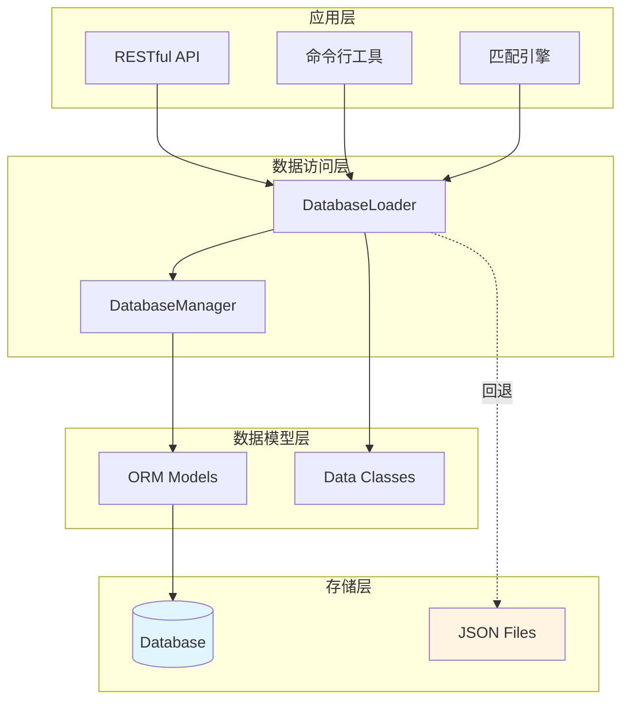
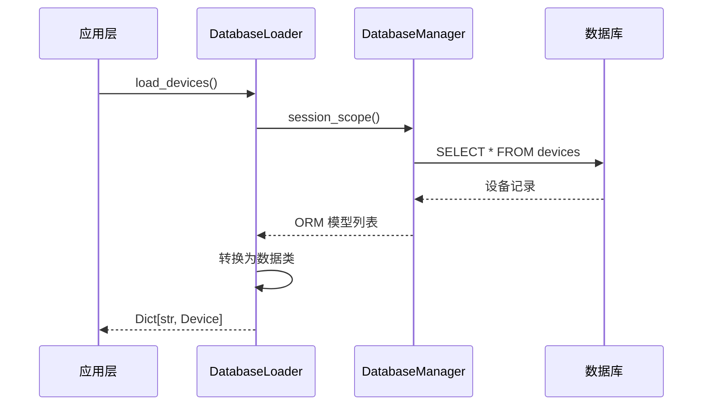
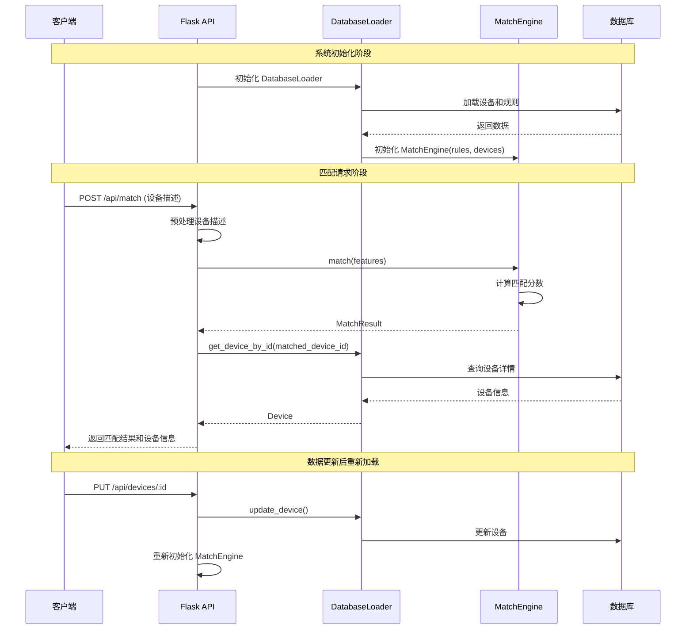
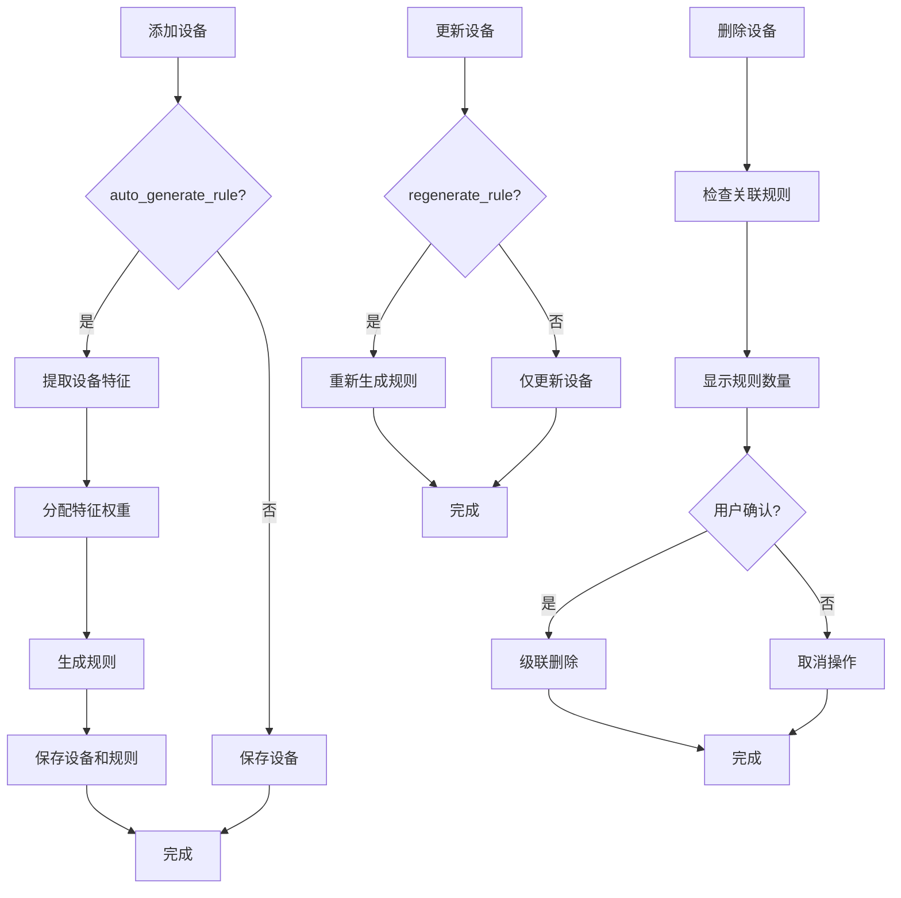

# 设计文档 - 数据库迁移

## 概述

本设计文档描述了将 DDC 设备清单匹配报价系统从静态 JSON 文件存储迁移到关系型数据库存储的技术方案。系统将支持 SQLite 和 MySQL 两种数据库，使用 SQLAlchemy ORM 框架进行数据访问，并保持与现有 JSON 模式的向后兼容性。

### 设计目标

1. **数据持久化**: 使用关系型数据库替代 JSON 文件，支持大规模数据管理
2. **向后兼容**: 保持 JSON 模式可用，支持存储模式切换和自动回退
3. **数据完整性**: 通过外键约束和事务管理确保数据一致性
4. **易用性**: 提供统一的数据访问接口和 RESTful API
5. **可维护性**: 使用 ORM 框架简化数据库操作，提供完整的 CRUD 功能

### 技术栈

- **ORM 框架**: SQLAlchemy 1.4+
- **数据库**: SQLite 3.x（开发/测试）、MySQL 8.0+（生产）
- **Python 版本**: 3.8+
- **Web 框架**: Flask（用于 RESTful API）

## 架构

### 系统架构图


```mermaid
graph TB
    subgraph "应用层"
        API[RESTful API]
        CLI[命令行工具]
        Matcher[匹配引擎]
    end
    
    subgraph "数据访问层"
        Loader[DatabaseLoader]
        Manager[DatabaseManager]
    end
    
    subgraph "数据模型层"
        Models[ORM Models]
        DataClasses[Data Classes]
    end
    
    subgraph "存储层"
        DB[(Database)]
        JSON[JSON Files]
    end
    
    API --> Loader
    CLI --> Loader
    Matcher --> Loader
    Loader --> Manager
    Loader --> DataClasses
    Manager --> Models
    Models --> DB
    
    Loader -.回退.-> JSON
    
    style DB fill:#e1f5ff
    style JSON fill:#fff4e1
```

### 存储模式切换机制

系统支持两种存储模式，通过配置文件控制：

1. **JSON 模式** (`STORAGE_MODE=json`): 使用现有的 JSON 文件加载逻辑
2. **数据库模式** (`STORAGE_MODE=database`): 使用新的数据库加载逻辑

当数据库连接失败且 `FALLBACK_TO_JSON=true` 时，系统自动回退到 JSON 模式。

### 数据流


```mermaid
sequenceDiagram
    participant App as 应用层
    participant Loader as DatabaseLoader
    participant Manager as DatabaseManager
    participant DB as 数据库
    
    App->>Loader: load_devices()
    Loader->>Manager: session_scope()
    Manager->>DB: SELECT * FROM devices
    DB-->>Manager: 设备记录
    Manager-->>Loader: ORM 模型列表
    Loader->>Loader: 转换为数据类
    Loader-->>App: Dict[str, Device]
```

## 组件和接口

### 1. DatabaseManager（数据库管理器）

**职责**: 管理数据库连接、会话和事务

**接口**:

```python
class DatabaseManager:
    def __init__(self, database_url: str, echo: bool = False):
        """初始化数据库连接"""
        
    def create_tables(self) -> None:
        """创建所有数据库表"""
        
    @contextmanager
    def session_scope(self):
        """提供事务会话上下文管理器"""
        
    def get_session(self):
        """获取新的数据库会话"""
        
    def close(self) -> None:
        """关闭数据库连接"""
```

**验证需求**: 1.1, 1.2, 1.3, 1.4, 1.5, 6.1-6.5, 8.2, 8.4

### 2. DatabaseLoader（数据库加载器）

**职责**: 提供数据访问接口，将 ORM 模型转换为数据类

**核心功能**:
1. 数据查询和加载（设备、规则、配置）
2. CRUD 操作（创建、读取、更新、删除）
3. 批量操作支持
4. 数据一致性检查
5. ORM 模型与数据类的双向转换

**接口**:

```python
class DatabaseLoader:
    def __init__(self, db_manager: DatabaseManager, preprocessor=None):
        """
        初始化数据库加载器
        
        Args:
            db_manager: 数据库管理器实例
            preprocessor: 文本预处理器（用于规则生成）
        """
        
    # ========== 查询操作 ==========
    
    def load_devices(self) -> Dict[str, Device]:
        """
        从数据库加载所有设备
        
        Returns:
            设备字典，key 为 device_id
            
        Raises:
            Exception: 数据库查询失败
            
        验证需求: 4.1, 19.1
        """
        
    def load_rules(self) -> List[Rule]:
        """
        从数据库加载所有规则
        
        Returns:
            规则列表
            
        Raises:
            Exception: 数据库查询失败
            
        验证需求: 4.2, 19.2
        """
        
    def get_device_by_id(self, device_id: str) -> Optional[Device]:
        """
        根据 ID 查询单个设备
        
        Args:
            device_id: 设备 ID
            
        Returns:
            设备实例，不存在返回 None
            
        Raises:
            Exception: 数据库查询失败
            
        验证需求: 4.3, 4.5, 19.3
        """
        
    def get_rule_by_id(self, rule_id: str) -> Optional[Rule]:
        """
        根据 ID 查询单个规则
        
        Args:
            rule_id: 规则 ID
            
        Returns:
            规则实例，不存在返回 None
            
        验证需求: 14.2, 22.2
        """
        
    def get_rules_by_device(self, device_id: str) -> List[Rule]:
        """
        查询指定设备的所有规则
        
        Args:
            device_id: 设备 ID
            
        Returns:
            规则列表
            
        验证需求: 14.2, 22.3
        """
        
    def load_config(self) -> Dict:
        """
        从数据库加载所有配置
        
        Returns:
            配置字典
            
        验证需求: 15.1, 19.7, 23.1
        """
        
    def get_config_by_key(self, config_key: str) -> Optional[Any]:
        """
        根据键查询配置值
        
        Args:
            config_key: 配置键
            
        Returns:
            配置值，不存在返回 None
            
        验证需求: 15.2, 23.2
        """
        
    # ========== 设备 CRUD 操作 ==========
    
    def add_device(self, device: Device, auto_generate_rule: bool = True) -> bool:
        """
        添加新设备
        
        Args:
            device: 设备实例
            auto_generate_rule: 是否自动生成匹配规则
            
        Returns:
            是否添加成功
            
        Raises:
            Exception: 数据库操作失败
            
        验证需求: 9.1, 13.3, 13.4, 18.1, 19.4
        """
        
    def update_device(self, device: Device, regenerate_rule: bool = False) -> bool:
        """
        更新设备信息
        
        Args:
            device: 设备实例
            regenerate_rule: 是否重新生成匹配规则
            
        Returns:
            是否更新成功
            
        Raises:
            Exception: 数据库操作失败
            
        验证需求: 9.2, 13.6, 13.7, 18.7, 19.5
        """
        
    def delete_device(self, device_id: str) -> Tuple[bool, int]:
        """
        删除设备（级联删除关联规则）
        
        Args:
            device_id: 设备 ID
            
        Returns:
            (是否删除成功, 级联删除的规则数量)
            
        Raises:
            Exception: 数据库操作失败
            
        验证需求: 9.3, 13.8, 18.5, 18.6, 19.6
        """
        
    # ========== 规则 CRUD 操作 ==========
    
    def add_rule(self, rule: Rule) -> bool:
        """
        添加新规则
        
        Args:
            rule: 规则实例
            
        Returns:
            是否添加成功
            
        Raises:
            Exception: 数据库操作失败或外键约束失败
            
        验证需求: 14.4, 14.5, 14.6, 22.4
        """
        
    def update_rule(self, rule: Rule) -> bool:
        """
        更新规则信息
        
        Args:
            rule: 规则实例
            
        Returns:
            是否更新成功
            
        Raises:
            Exception: 数据库操作失败
            
        验证需求: 14.7, 22.5
        """
        
    def delete_rule(self, rule_id: str) -> bool:
        """
        删除规则（不影响设备）
        
        Args:
            rule_id: 规则 ID
            
        Returns:
            是否删除成功
            
        Raises:
            Exception: 数据库操作失败
            
        验证需求: 14.8, 14.9, 22.6
        """
        
    # ========== 配置 CRUD 操作 ==========
    
    def add_config(self, config_key: str, config_value: Any, description: str = '') -> bool:
        """
        添加新配置
        
        Args:
            config_key: 配置键
            config_value: 配置值（JSON 格式）
            description: 配置描述
            
        Returns:
            是否添加成功
            
        验证需求: 15.3, 23.4
        """
        
    def update_config(self, config_key: str, config_value: Any) -> bool:
        """
        更新配置值
        
        Args:
            config_key: 配置键
            config_value: 新的配置值
            
        Returns:
            是否更新成功
            
        验证需求: 15.4, 23.3
        """
        
    def delete_config(self, config_key: str) -> bool:
        """
        删除配置
        
        Args:
            config_key: 配置键
            
        Returns:
            是否删除成功
            
        验证需求: 15.5, 23.5
        """
        
    # ========== 批量操作 ==========
    
    def batch_add_devices(self, devices: List[Device], auto_generate_rules: bool = True, 
                         batch_size: int = 100) -> Dict[str, int]:
        """
        批量添加设备
        
        Args:
            devices: 设备列表
            auto_generate_rules: 是否自动生成规则
            batch_size: 批量大小
            
        Returns:
            统计信息 {'inserted': int, 'updated': int, 'failed': int}
            
        验证需求: 13.9, 13.10, 18.4
        """
        
    def batch_generate_rules(self, device_ids: List[str]) -> Dict[str, int]:
        """
        批量生成规则
        
        Args:
            device_ids: 设备 ID 列表
            
        Returns:
            统计信息 {'generated': int, 'updated': int, 'failed': int}
            
        验证需求: 14.12, 18.4, 22.7
        """
        
    # ========== 数据一致性检查 ==========
    
    def find_devices_without_rules(self) -> List[Device]:
        """
        查找没有规则的设备
        
        Returns:
            没有规则的设备列表
            
        验证需求: 14.3, 18.3
        """
        
    def find_orphan_rules(self) -> List[Rule]:
        """
        查找孤立规则（target_device_id 不存在）
        
        Returns:
            孤立规则列表
            
        验证需求: 18.8
        """
        
    def check_data_consistency(self) -> Dict[str, Any]:
        """
        执行数据一致性检查
        
        Returns:
            检查报告 {
                'devices_without_rules': List[str],
                'orphan_rules': List[str],
                'total_devices': int,
                'total_rules': int,
                'issues_found': int
            }
            
        验证需求: 18.9, 18.10
        """
        
    # ========== 内部辅助方法 ==========
    
    def _model_to_device(self, device_model: DeviceModel) -> Device:
        """将 ORM 模型转换为数据类 - 验证需求: 19.8"""
        
    def _device_to_model(self, device: Device) -> DeviceModel:
        """将数据类转换为 ORM 模型 - 验证需求: 19.8"""
        
    def _model_to_rule(self, rule_model: RuleModel) -> Rule:
        """将 ORM 模型转换为数据类 - 验证需求: 19.8"""
        
    def _rule_to_model(self, rule: Rule) -> RuleModel:
        """将数据类转换为 ORM 模型 - 验证需求: 19.8"""
```

**验证需求**: 4.1-4.5, 9.1-9.5, 13.1-13.11, 14.1-14.12, 15.1-15.7, 16.1-16.6, 18.1-18.10, 19.1-19.8

### 3. RuleGenerator（规则生成器）- 优化版

**职责**: 为设备自动生成匹配规则,支持基于device_type和key_params的优化特征提取

**接口**:

```python
class RuleGenerator:
    def __init__(self, preprocessor, default_threshold: float = 0.7):
        """初始化规则生成器"""
        
    def generate_rule(self, device: Device) -> Rule:
        """
        为单个设备生成规则
        
        验证需求: 3.3, 3.4, 38.5
        """
        
    def extract_features(self, device: Device) -> List[str]:
        """
        提取设备特征 - 优化版
        
        特征提取优先级:
        1. 品牌特征(高权重)
        2. 设备类型特征(高权重) - 新增
        3. 型号特征(高权重)
        4. 关键参数特征(中权重) - 从key_params提取
        5. 设备名称特征(中权重)
        6. 详细参数特征(低权重) - 仅当key_params为空时使用
        
        验证需求: 3.1, 38.1, 38.4
        """
        
    def assign_weights(self, features: List[str], device: Device) -> Dict[str, float]:
        """
        为特征分配权重 - 优化版
        
        权重分配策略:
        - 品牌权重: 3.0
        - 设备类型权重: 3.0 (新增)
        - 型号权重: 3.0
        - 关键参数权重: 2.5 (新增)
        - 设备名称关键词权重: 2.0
        - 其他特征权重: 1.0
        
        验证需求: 3.2, 38.2, 38.3
        """
```

**实现示例**:

```python
def extract_features(self, device: Device) -> List[str]:
    """提取设备特征 - 优化版"""
    features = []
    
    # 1. 品牌特征(高权重)
    if device.brand:
        features.append(device.brand)
    
    # 2. 设备类型特征(高权重) - 新增
    if device.device_type:
        features.append(device.device_type)
    
    # 3. 型号特征(高权重)
    if device.spec_model:
        features.append(device.spec_model)
    
    # 4. 关键参数特征(中权重) - 从key_params提取
    if device.key_params:
        for param_name, param_data in device.key_params.items():
            if isinstance(param_data, dict):
                value = param_data.get('value', '')
            else:
                value = str(param_data)
            
            if value:
                # 提取参数值中的关键词
                tokens = self.preprocessor.preprocess(value)
                features.extend(tokens)
    
    # 5. 设备名称特征(中权重)
    if device.device_name:
        tokens = self.preprocessor.preprocess(device.device_name)
        features.extend(tokens)
    
    # 6. 详细参数特征(低权重) - 仅当key_params为空时使用
    if not device.key_params and device.detailed_params:
        tokens = self.preprocessor.preprocess(device.detailed_params)
        features.extend(tokens)
    
    # 去重
    return list(set(features))

def assign_weights(self, features: List[str], device: Device) -> Dict[str, float]:
    """分配特征权重 - 优化版"""
    weights = {}
    
    for feature in features:
        # 品牌权重: 3.0
        if device.brand and feature == device.brand:
            weights[feature] = 3.0
        
        # 设备类型权重: 3.0
        elif device.device_type and feature == device.device_type:
            weights[feature] = 3.0
        
        # 型号权重: 3.0
        elif device.spec_model and feature in device.spec_model:
            weights[feature] = 3.0
        
        # 关键参数权重: 2.5
        elif device.key_params and any(
            feature in str(param_data.get('value', '')) 
            for param_data in device.key_params.values()
            if isinstance(param_data, dict)
        ):
            weights[feature] = 2.5
        
        # 设备名称关键词权重: 2.0
        elif device.device_name and feature in device.device_name:
            weights[feature] = 2.0
        
        # 其他特征权重: 1.0
        else:
            weights[feature] = 1.0
    
    return weights
```

**验证需求**: 3.1-3.5, 13.4, 13.10, 38.1-38.5

### 4. MigrationTool（迁移工具）

**职责**: 将 JSON 数据迁移到数据库

**接口**:

```python
class MigrationTool:
    def __init__(self, db_manager: DatabaseManager):
        """初始化迁移工具"""
        
    def migrate_from_json(self, device_file: str, rule_file: str, config_file: str) -> Dict[str, int]:
        """从JSON文件迁移数据"""
        
    def migrate_devices(self, devices: List[Dict]) -> int:
        """迁移设备数据"""
        
    def migrate_rules(self, rules: List[Dict]) -> int:
        """迁移规则数据"""
        
    def migrate_configs(self, configs: Dict) -> int:
        """迁移配置数据"""
```

**验证需求**: 7.1-7.5

### 5. ExcelImporter（Excel 导入器）

**职责**: 从 Excel 文件导入设备数据

**接口**:

```python
class ExcelImporter:
    def __init__(self, db_loader: DatabaseLoader, rule_generator: RuleGenerator):
        """初始化Excel导入器"""
        
    def import_from_excel(self, excel_file: str, auto_generate_rules: bool = True) -> Dict[str, int]:
        """从Excel导入设备"""
        
    def parse_excel(self, excel_file: str) -> List[Device]:
        """解析Excel文件"""
        
    def validate_device(self, device_data: Dict) -> bool:
        """验证设备数据完整性"""
```

**验证需求**: 2.1-2.7

### 6. StatisticsReporter（统计报告器）

**职责**: 生成数据库统计报告

**接口**:

```python
class StatisticsReporter:
    def __init__(self, db_manager: DatabaseManager):
        """初始化统计报告器"""
        
    def get_table_counts(self) -> Dict[str, int]:
        """获取各表记录数"""
        
    def get_devices_by_brand(self) -> Dict[str, int]:
        """按品牌统计设备数量"""
        
    def get_rule_coverage(self) -> Dict[str, int]:
        """统计规则覆盖情况"""
        
    def get_database_size(self) -> float:
        """获取数据库大小（MB）"""
        
    def generate_report(self) -> str:
        """生成格式化报告"""
```

**验证需求**: 17.1-17.6

### 7. RESTful API 接口

**设备管理 API**:

```python
# GET /api/devices - 获取所有设备
# GET /api/devices/:id - 获取指定设备
# POST /api/devices - 创建新设备
# PUT /api/devices/:id - 更新设备
# DELETE /api/devices/:id - 删除设备
```

**规则管理 API**:

```python
# GET /api/rules - 获取所有规则
# GET /api/rules/:id - 获取指定规则
# GET /api/rules?device_id=xxx - 获取设备的规则
# POST /api/rules - 创建新规则
# PUT /api/rules/:id - 更新规则
# DELETE /api/rules/:id - 删除规则
# POST /api/rules/generate - 批量生成规则
```

**配置管理 API**:

```python
# GET /api/config - 获取所有配置
# GET /api/config/:key - 获取指定配置
# POST /api/config - 创建配置
# PUT /api/config - 更新配置
# DELETE /api/config/:key - 删除配置
```

**验证需求**: 21.1-21.7, 22.1-22.7, 23.1-23.7

## 数据模型

### ORM 模型定义

#### Device（设备模型）- 优化版

```python
class Device(Base):
    __tablename__ = 'devices'
    
    # 基础字段
    device_id = Column(String(100), primary_key=True)
    brand = Column(String(50), nullable=False, index=True)
    device_name = Column(String(100), nullable=False, index=True)
    spec_model = Column(String(200), nullable=False)
    
    # ✅ 新增: 设备类型字段 - 支持动态表单
    device_type = Column(String(50), nullable=True, index=True, 
                        comment='设备类型,如:CO2传感器、座阀、温度传感器等')
    
    # ✅ 修改: detailed_params改为可选 - 避免与key_params重复
    detailed_params = Column(Text, nullable=True, 
                            comment='详细参数文本描述(可选,主要用于向后兼容)')
    
    unit_price = Column(Float, nullable=False)
    
    # 智能设备录入字段
    raw_description = Column(Text, nullable=True, 
                            comment='用户输入的原始设备描述文本')
    
    # ✅ 规范化: key_params结构 - 支持结构化参数存储
    key_params = Column(JSON, nullable=True, 
                       comment='根据设备类型提取的关键参数(JSON格式)')
    
    confidence_score = Column(Float, nullable=True, index=True, 
                             comment='解析结果的置信度评分(0.0-1.0)')
    
    # ✅ 新增: 数据来源标识 - 追溯数据来源
    input_method = Column(String(20), nullable=True, default='manual', index=True,
                         comment='录入方式: manual(手动), intelligent(智能解析), excel(Excel导入)')
    
    # ✅ 新增: 创建和更新时间 - 追溯数据变更历史
    created_at = Column(DateTime, nullable=True, default=datetime.utcnow)
    updated_at = Column(DateTime, nullable=True, default=datetime.utcnow, onupdate=datetime.utcnow)
    
    # 关联规则 - 级联删除
    rules = relationship("Rule", back_populates="device", cascade="all, delete-orphan")
```

**字段说明**:

**基础字段**:
- `device_id`: 设备唯一标识（主键）
- `brand`: 品牌（索引字段）
- `device_name`: 设备名称（索引字段）
- `spec_model`: 规格型号
- `device_type`: 设备类型（索引字段,支持动态表单）- **新增**
- `detailed_params`: 详细参数文本（可选,向后兼容）- **改为可选**
- `unit_price`: 单价

**智能设备录入字段**:
- `raw_description`: 原始设备描述文本（智能解析输入）
- `key_params`: 关键参数JSON（结构化存储）
- `confidence_score`: 解析置信度（0.0-1.0）

**数据追溯字段**:
- `input_method`: 录入方式（manual/intelligent/excel）- **新增**
- `created_at`: 创建时间 - **新增**
- `updated_at`: 更新时间 - **新增**

**key_params JSON结构规范**:
```json
{
  "量程": {
    "value": "0-2000 ppm",
    "raw_value": "0-2000 ppm",
    "data_type": "range",
    "unit": "ppm",
    "confidence": 0.95
  },
  "输出信号": {
    "value": "4-20 mA",
    "raw_value": "4-20mA",
    "data_type": "string",
    "unit": "mA",
    "confidence": 0.98
  }
}
```

**验证需求**: 11.1, 11.5, 30.1-30.5, 31.1-31.5, 32.1-32.5, 33.1-33.5, 34.1-34.5

#### Rule（规则模型）

```python
class Rule(Base):
    __tablename__ = 'rules'
    
    rule_id = Column(String(100), primary_key=True)
    target_device_id = Column(String(100), ForeignKey('devices.device_id'), nullable=False, index=True)
    auto_extracted_features = Column(JSON, nullable=False)
    feature_weights = Column(JSON, nullable=False)
    match_threshold = Column(Float, nullable=False)
    remark = Column(Text)
    
    # 关联设备
    device = relationship("Device", back_populates="rules")
```

**字段说明**:
- `rule_id`: 规则唯一标识（主键）
- `target_device_id`: 目标设备ID（外键，索引字段）
- `auto_extracted_features`: 自动提取的特征（JSON 数组）
- `feature_weights`: 特征权重（JSON 对象）
- `match_threshold`: 匹配阈值
- `remark`: 备注

**验证需求**: 11.2, 11.4, 11.5

#### Config（配置模型）

```python
class Config(Base):
    __tablename__ = 'configs'
    
    config_key = Column(String(100), primary_key=True)
    config_value = Column(JSON, nullable=False)
    description = Column(Text)
```

**字段说明**:
- `config_key`: 配置键（主键）
- `config_value`: 配置值（JSON 格式）
- `description`: 配置描述

**验证需求**: 11.3

### 数据类定义

系统使用数据类（dataclass）作为应用层的数据传输对象：

```python
from dataclasses import dataclass, field
from typing import Optional, Dict, Any
from datetime import datetime

@dataclass
class Device:
    device_id: str
    brand: str
    device_name: str
    spec_model: str
    unit_price: float
    
    # 可选字段
    device_type: Optional[str] = None
    detailed_params: Optional[str] = None
    raw_description: Optional[str] = None
    key_params: Optional[Dict[str, Any]] = None
    confidence_score: Optional[float] = None
    input_method: str = 'manual'
    created_at: Optional[datetime] = None
    updated_at: Optional[datetime] = None

@dataclass
class Rule:
    rule_id: str
    target_device_id: str
    auto_extracted_features: List[str]
    feature_weights: Dict[str, float]
    match_threshold: float
    remark: str = ''
```

### 数据库索引策略

为提高查询性能，在以下字段创建索引：

1. `devices.brand` - 支持按品牌过滤
2. `devices.device_name` - 支持按名称搜索
3. `devices.device_type` - 支持按设备类型过滤 **（新增）**
4. `devices.input_method` - 支持按录入方式过滤 **（新增）**
5. `devices.confidence_score` - 支持按置信度排序
6. `rules.target_device_id` - 支持快速查询设备的规则

**验证需求**: 11.5, 30.2, 32.2

### 外键约束

`rules.target_device_id` 外键约束确保：
- 规则必须关联到存在的设备
- 删除设备时级联删除关联的规则
- 维护数据引用完整性

**验证需求**: 11.4, 13.8, 14.9


## 业务流程

### 数据库模式下的设备匹配流程

**验证需求**: 20.1-20.6


```mermaid
sequenceDiagram
    participant Client as 客户端
    participant API as Flask API
    participant Loader as DatabaseLoader
    participant Engine as MatchEngine
    participant DB as 数据库
    
    Note over Client,DB: 系统初始化阶段
    API->>Loader: 初始化 DatabaseLoader
    Loader->>DB: 加载设备和规则
    DB-->>Loader: 返回数据
    Loader->>Engine: 初始化 MatchEngine(rules, devices)
    
    Note over Client,DB: 匹配请求阶段
    Client->>API: POST /api/match (设备描述)
    API->>API: 预处理设备描述
    API->>Engine: match(features)
    Engine->>Engine: 计算匹配分数
    Engine-->>API: MatchResult
    API->>Loader: get_device_by_id(matched_device_id)
    Loader->>DB: 查询设备详情
    DB-->>Loader: 设备信息
    Loader-->>API: Device
    API-->>Client: 返回匹配结果和设备信息
    
    Note over Client,DB: 数据更新后重新加载
    Client->>API: PUT /api/devices/:id
    API->>Loader: update_device()
    Loader->>DB: 更新设备
    API->>API: 重新初始化 MatchEngine
```

**关键点**:

1. **初始化阶段**: 系统启动时从数据库加载所有设备和规则，初始化匹配引擎
2. **匹配阶段**: 使用内存中的规则进行匹配，匹配成功后从数据库查询完整设备信息
3. **数据更新**: 设备或规则更新后，提供重新加载机制更新匹配引擎
4. **性能保证**: 匹配过程在内存中进行，性能与 JSON 模式相当

### 设备和规则关联管理流程

**验证需求**: 18.1-18.10


```mermaid
flowchart TD
    Start[添加设备] --> CheckOption{auto_generate_rule?}
    CheckOption -->|是| ExtractFeatures[提取设备特征]
    CheckOption -->|否| SaveDevice[保存设备]
    
    ExtractFeatures --> AssignWeights[分配特征权重]
    AssignWeights --> GenerateRule[生成规则]
    GenerateRule --> SaveBoth[保存设备和规则]
    SaveBoth --> End[完成]
    SaveDevice --> End
    
    UpdateDevice[更新设备] --> CheckRegen{regenerate_rule?}
    CheckRegen -->|是| RegenerateRule[重新生成规则]
    CheckRegen -->|否| UpdateOnly[仅更新设备]
    RegenerateRule --> UpdateEnd[完成]
    UpdateOnly --> UpdateEnd
    
    DeleteDevice[删除设备] --> CheckRules[检查关联规则]
    CheckRules --> ShowCount[显示规则数量]
    ShowCount --> Confirm{用户确认?}
    Confirm -->|是| CascadeDelete[级联删除]
    Confirm -->|否| Cancel[取消操作]
    CascadeDelete --> DeleteEnd[完成]
    Cancel --> DeleteEnd
```

## RESTful API 详细设计

### API 通用规范

**请求格式**:
- Content-Type: `application/json`
- 字符编码: UTF-8

**响应格式**:
```json
{
  "success": true/false,
  "data": {},           // 成功时返回的数据
  "message": "string",  // 操作消息
  "error_code": "string",    // 错误码（失败时）
  "error_message": "string"  // 错误详情（失败时）
}
```

**HTTP 状态码**:
- 200: 操作成功
- 201: 创建成功
- 400: 请求参数错误
- 404: 资源不存在
- 500: 服务器内部错误

### 设备管理 API

**验证需求**: 21.1-21.7

#### 1. 获取所有设备

```
GET /api/devices
```

**查询参数**:
- `brand` (可选): 按品牌过滤
- `name` (可选): 按名称模糊搜索
- `min_price` (可选): 最低价格
- `max_price` (可选): 最高价格
- `page` (可选): 页码，默认 1
- `page_size` (可选): 每页数量，默认 50

**响应示例**:
```json
{
  "success": true,
  "data": {
    "devices": [
      {
        "device_id": "D001",
        "brand": "霍尼韦尔",
        "device_name": "温度传感器",
        "spec_model": "T7350A1008",
        "detailed_params": "测量范围: -40~120℃",
        "unit_price": 450.0,
        "has_rules": true
      }
    ],
    "total": 100,
    "page": 1,
    "page_size": 50
  }
}
```

#### 2. 获取单个设备

```
GET /api/devices/:id
```

**路径参数**:
- `id`: 设备 ID

**响应示例**:
```json
{
  "success": true,
  "data": {
    "device_id": "D001",
    "brand": "霍尼韦尔",
    "device_name": "温度传感器",
    "spec_model": "T7350A1008",
    "detailed_params": "测量范围: -40~120℃",
    "unit_price": 450.0,
    "rules": [
      {
        "rule_id": "R_D001",
        "match_threshold": 0.7
      }
    ]
  }
}
```

#### 3. 创建设备

```
POST /api/devices
```

**请求体**:
```json
{
  "device_id": "D002",
  "brand": "西门子",
  "device_name": "压力传感器",
  "spec_model": "QBE2003-P25",
  "detailed_params": "测量范围: 0-25bar",
  "unit_price": 680.0,
  "auto_generate_rule": true
}
```

**响应示例**:
```json
{
  "success": true,
  "data": {
    "device_id": "D002",
    "rule_generated": true
  },
  "message": "设备创建成功，已自动生成匹配规则"
}
```

#### 4. 更新设备

```
PUT /api/devices/:id
```

**请求体**:
```json
{
  "brand": "西门子",
  "device_name": "压力传感器",
  "spec_model": "QBE2003-P25",
  "detailed_params": "测量范围: 0-25bar, 精度: ±0.5%",
  "unit_price": 720.0,
  "regenerate_rule": true
}
```

**响应示例**:
```json
{
  "success": true,
  "data": {
    "device_id": "D002",
    "rule_regenerated": true
  },
  "message": "设备更新成功，已重新生成匹配规则"
}
```

#### 5. 删除设备

```
DELETE /api/devices/:id
```

**响应示例**:
```json
{
  "success": true,
  "data": {
    "device_id": "D002",
    "rules_deleted": 1
  },
  "message": "设备删除成功，已级联删除 1 条关联规则"
}
```

### 规则管理 API

**验证需求**: 22.1-22.7

#### 1. 获取所有规则

```
GET /api/rules
```

**查询参数**:
- `device_id` (可选): 按设备 ID 过滤

**响应示例**:
```json
{
  "success": true,
  "data": {
    "rules": [
      {
        "rule_id": "R_D001",
        "target_device_id": "D001",
        "auto_extracted_features": ["霍尼韦尔", "温度传感器", "T7350A1008"],
        "feature_weights": {
          "霍尼韦尔": 3.0,
          "温度传感器": 2.5,
          "T7350A1008": 3.0
        },
        "match_threshold": 0.7,
        "device_name": "温度传感器"
      }
    ],
    "total": 50
  }
}
```

#### 2. 获取单个规则

```
GET /api/rules/:id
```

**响应示例**:
```json
{
  "success": true,
  "data": {
    "rule_id": "R_D001",
    "target_device_id": "D001",
    "auto_extracted_features": ["霍尼韦尔", "温度传感器", "T7350A1008"],
    "feature_weights": {
      "霍尼韦尔": 3.0,
      "温度传感器": 2.5,
      "T7350A1008": 3.0
    },
    "match_threshold": 0.7,
    "remark": "自动生成的规则",
    "device": {
      "device_id": "D001",
      "device_name": "温度传感器",
      "brand": "霍尼韦尔"
    }
  }
}
```

#### 3. 创建规则

```
POST /api/rules
```

**请求体**:
```json
{
  "rule_id": "R_D003",
  "target_device_id": "D003",
  "auto_extracted_features": ["施耐德", "控制器", "DDC"],
  "feature_weights": {
    "施耐德": 3.0,
    "控制器": 2.5,
    "DDC": 2.5
  },
  "match_threshold": 0.7,
  "remark": "手动创建的规则"
}
```

**响应示例**:
```json
{
  "success": true,
  "data": {
    "rule_id": "R_D003"
  },
  "message": "规则创建成功"
}
```

#### 4. 更新规则

```
PUT /api/rules/:id
```

**请求体**:
```json
{
  "auto_extracted_features": ["施耐德", "控制器", "DDC", "网络"],
  "feature_weights": {
    "施耐德": 3.0,
    "控制器": 2.5,
    "DDC": 2.5,
    "网络": 2.0
  },
  "match_threshold": 0.75
}
```

**响应示例**:
```json
{
  "success": true,
  "data": {
    "rule_id": "R_D003"
  },
  "message": "规则更新成功"
}
```

#### 5. 删除规则

```
DELETE /api/rules/:id
```

**响应示例**:
```json
{
  "success": true,
  "data": {
    "rule_id": "R_D003"
  },
  "message": "规则删除成功"
}
```

#### 6. 批量生成规则

```
POST /api/rules/generate
```

**请求体**:
```json
{
  "device_ids": ["D004", "D005", "D006"],
  "force_regenerate": false
}
```

**响应示例**:
```json
{
  "success": true,
  "data": {
    "generated": 2,
    "updated": 1,
    "failed": 0,
    "details": [
      {"device_id": "D004", "status": "generated"},
      {"device_id": "D005", "status": "generated"},
      {"device_id": "D006", "status": "updated"}
    ]
  },
  "message": "批量生成规则完成：生成 2 条，更新 1 条"
}
```

### 配置管理 API

**验证需求**: 23.1-23.7

#### 1. 获取所有配置

```
GET /api/config
```

**响应示例**:
```json
{
  "success": true,
  "data": {
    "global_config": {
      "default_match_threshold": 0.7,
      "max_match_results": 5
    },
    "text_preprocessing": {
      "feature_split_chars": [",", "，", " "],
      "normalize_chars": {"（": "(", "）": ")"}
    }
  }
}
```

#### 2. 获取单个配置

```
GET /api/config/:key
```

**响应示例**:
```json
{
  "success": true,
  "data": {
    "config_key": "global_config",
    "config_value": {
      "default_match_threshold": 0.7,
      "max_match_results": 5
    },
    "description": "全局配置项"
  }
}
```

#### 3. 创建配置

```
POST /api/config
```

**请求体**:
```json
{
  "config_key": "custom_settings",
  "config_value": {
    "enable_cache": true,
    "cache_ttl": 3600
  },
  "description": "自定义设置"
}
```

**响应示例**:
```json
{
  "success": true,
  "data": {
    "config_key": "custom_settings"
  },
  "message": "配置创建成功"
}
```

#### 4. 更新配置

```
PUT /api/config
```

**请求体**:
```json
{
  "updates": {
    "global_config": {
      "default_match_threshold": 0.75,
      "max_match_results": 10
    }
  }
}
```

**响应示例**:
```json
{
  "success": true,
  "data": {
    "updated_keys": ["global_config"],
    "components_reinitialized": ["preprocessor", "match_engine"]
  },
  "message": "配置更新成功，已重新初始化相关组件"
}
```

#### 5. 删除配置

```
DELETE /api/config/:key
```

**响应示例**:
```json
{
  "success": true,
  "data": {
    "config_key": "custom_settings"
  },
  "message": "配置删除成功"
}
```

## 错误处理

### 错误码定义

| 错误码 | 说明 | HTTP 状态码 |
|--------|------|-------------|
| `DEVICE_NOT_FOUND` | 设备不存在 | 404 |
| `DEVICE_ALREADY_EXISTS` | 设备已存在 | 400 |
| `RULE_NOT_FOUND` | 规则不存在 | 404 |
| `RULE_ALREADY_EXISTS` | 规则已存在 | 400 |
| `INVALID_DEVICE_ID` | 无效的设备 ID | 400 |
| `FOREIGN_KEY_VIOLATION` | 外键约束失败 | 400 |
| `CONFIG_NOT_FOUND` | 配置不存在 | 404 |
| `INVALID_JSON_FORMAT` | 无效的 JSON 格式 | 400 |
| `DATABASE_ERROR` | 数据库操作失败 | 500 |
| `VALIDATION_ERROR` | 数据验证失败 | 400 |

### 错误响应示例

```json
{
  "success": false,
  "error_code": "DEVICE_NOT_FOUND",
  "error_message": "设备不存在: D999",
  "details": {
    "device_id": "D999",
    "timestamp": "2026-02-14T10:30:00Z"
  }
}
```

## 性能优化

### 数据库查询优化

1. **索引使用**: 在 `brand`、`device_name`、`target_device_id` 字段上创建索引
2. **批量操作**: 使用批量插入/更新减少数据库往返次数
3. **连接池**: 配置合适的连接池大小（默认 5-10 个连接）
4. **查询缓存**: 对频繁查询的配置数据使用应用层缓存

### 匹配性能保证

1. **内存加载**: 系统启动时将所有设备和规则加载到内存
2. **增量更新**: 数据更新时仅重新加载变更的部分
3. **性能目标**: 单次匹配响应时间 < 100ms（与 JSON 模式相当）

**验证需求**: 20.6

## 安全考虑

### 数据验证

1. **输入验证**: 所有 API 输入进行严格验证
2. **SQL 注入防护**: 使用 ORM 参数化查询
3. **JSON 格式验证**: 验证 JSON 字段的格式和结构

### 访问控制

1. **API 认证**: 预留认证接口（当前版本未实现）
2. **操作日志**: 记录所有数据修改操作
3. **错误信息**: 避免泄露敏感的系统信息

## 前端界面设计

### 设备库管理界面

**验证需求**: 24.1-24.13, 25.1-25.7, 26.1-26.7

#### 页面结构

```
DeviceManagementView (设备库管理视图)
├── DeviceList (设备列表组件)
│   ├── 搜索和筛选区域
│   ├── 操作按钮区域（添加设备、批量导入、数据一致性检查）
│   ├── 设备列表表格
│   └── 分页组件
├── DeviceForm (设备表单对话框)
│   ├── 基本信息表单
│   └── 规则生成选项
├── DeviceDetail (设备详情对话框)
│   ├── 设备信息展示
│   ├── 关联规则展示
│   └── 操作按钮（编辑、删除、管理规则）
├── BatchImport (批量导入对话框)
│   ├── 文件上传区域
│   ├── 导入预览表格
│   └── 导入进度显示
└── ConsistencyCheck (数据一致性检查对话框)
    ├── 检查报告展示
    ├── 问题列表
    └── 修复操作按钮
```

#### DeviceList 组件

**功能**:
- 显示设备列表（表格形式）
- 支持搜索（设备名称、品牌、型号）
- 支持筛选（品牌、价格范围）
- 支持分页（20/50/100 条/页）
- 支持排序（按 ID、品牌、名称、价格）

**表格列**:
- 设备 ID
- 品牌
- 设备名称
- 规格型号
- 单价
- 是否有规则（图标显示）
- 操作（查看、编辑、删除）

**验证需求**: 24.1-24.5, 24.13

#### DeviceForm 组件

**功能**:
- 添加新设备
- 编辑现有设备
- 表单验证（必填字段、数据格式）
- 自动生成规则选项

**表单字段**:
- 设备 ID（添加时必填，编辑时只读）
- 品牌（必填）
- 设备名称（必填）
- 规格型号（必填）
- 详细参数（必填，多行文本）
- 单价（必填，数字）
- 自动生成规则（复选框，默认选中）
- 重新生成规则（编辑时显示，复选框）

**验证需求**: 24.6-24.10

#### DeviceDetail 组件

**功能**:
- 显示设备完整信息
- 显示关联的匹配规则
- 提供快捷操作（编辑、删除、管理规则）

**信息展示**:
- 设备基本信息（描述列表）
- 关联规则信息（规则 ID、阈值、特征数量）
- 规则详情链接

**操作按钮**:
- 编辑设备
- 删除设备
- 生成规则（无规则时）
- 重新生成规则（有规则时）
- 查看规则详情

**验证需求**: 24.5, 24.11-24.12, 26.1-26.7

#### BatchImport 组件

**功能**:
- 上传 Excel 文件
- 预览导入数据
- 显示导入进度
- 显示导入结果

**导入流程**:
1. 选择文件（支持 .xlsx 和 .xls）
2. 文件验证
3. 数据预览（前 10 条）
4. 确认导入
5. 显示进度条
6. 显示导入统计

**验证需求**: 25.1-25.7

#### ConsistencyCheck 组件

**功能**:
- 执行数据一致性检查
- 显示检查报告
- 提供问题修复选项

**检查报告内容**:
- 设备总数
- 规则总数
- 没有规则的设备列表
- 孤立规则列表
- 问题总数

**修复选项**:
- 为没有规则的设备批量生成规则
- 删除孤立规则

**验证需求**: 28.1-28.7

### 统计仪表板界面

**验证需求**: 27.1-27.8

#### 页面结构

```
StatisticsDashboard (统计仪表板视图)
├── SummaryCards (概览卡片)
│   ├── 设备总数卡片
│   ├── 规则总数卡片
│   ├── 品牌数量卡片
│   └── 规则覆盖率卡片
├── BrandChart (品牌分布图表)
│   └── 柱状图（品牌 vs 设备数量）
├── PriceChart (价格分布图表)
│   └── 直方图（价格区间 vs 设备数量）
├── RecentDevices (最近添加设备)
│   └── 列表（最新 10 条）
└── DevicesWithoutRules (无规则设备)
    ├── 列表
    └── 批量生成规则按钮
```

#### SummaryCards 组件

**显示内容**:
- 设备总数（大数字 + 图标）
- 规则总数（大数字 + 图标）
- 品牌数量（大数字 + 图标）
- 规则覆盖率（百分比 + 进度环）

**验证需求**: 27.1

#### BrandChart 组件

**图表类型**: 柱状图（使用 ECharts）

**数据展示**:
- X 轴：品牌名称
- Y 轴：设备数量
- 支持点击柱状图筛选该品牌的设备

**验证需求**: 27.2

#### PriceChart 组件

**图表类型**: 直方图（使用 ECharts）

**数据展示**:
- X 轴：价格区间（0-500, 500-1000, 1000-2000, 2000+）
- Y 轴：设备数量
- 支持点击区间筛选该价格范围的设备

**验证需求**: 27.3

#### RecentDevices 组件

**显示内容**:
- 最近添加的 10 个设备
- 显示设备 ID、名称、品牌、添加时间
- 点击可查看设备详情

**验证需求**: 27.5

#### DevicesWithoutRules 组件

**显示内容**:
- 没有规则的设备列表
- 显示设备 ID、名称、品牌
- 批量生成规则按钮

**验证需求**: 27.6, 27.7

### 用户体验设计

**验证需求**: 29.1-29.8

#### 加载状态

- 使用 Element Plus 的 `v-loading` 指令
- 全局加载：页面级操作（如加载列表）
- 局部加载：组件级操作（如提交表单）

#### 消息提示

- 成功提示：绿色，3 秒后自动消失
- 错误提示：红色，需要用户手动关闭
- 警告提示：橙色，5 秒后自动消失
- 信息提示：蓝色，3 秒后自动消失

#### 表单验证

- 实时验证：失焦时验证
- 提交验证：提交前验证所有字段
- 错误提示：字段下方显示红色错误文本

#### 确认对话框

- 删除操作：显示将被删除的内容和影响
- 批量操作：显示将被影响的记录数量
- 危险操作：使用红色按钮和警告图标

#### 性能优化

- 虚拟滚动：列表超过 100 条时启用
- 防抖：搜索输入 500ms 防抖
- 节流：滚动事件 200ms 节流
- 懒加载：图表组件按需加载

#### 响应式设计

- 支持桌面端（1920x1080 及以上）
- 支持笔记本端（1366x768 及以上）
- 表格在小屏幕上支持横向滚动

### 路由设计

```javascript
{
  path: '/database',
  name: 'DatabaseManagement',
  component: () => import('@/views/DatabaseManagementView.vue'),
  children: [
    {
      path: 'devices',
      name: 'DeviceManagement',
      component: () => import('@/views/DeviceManagementView.vue')
    },
    {
      path: 'statistics',
      name: 'DatabaseStatistics',
      component: () => import('@/views/StatisticsDashboardView.vue')
    }
  ]
}
```

### API 集成

前端组件将调用以下 API 接口：

**设备管理**:
- `GET /api/devices` - 获取设备列表
- `GET /api/devices/:id` - 获取设备详情
- `POST /api/devices` - 创建设备
- `PUT /api/devices/:id` - 更新设备
- `DELETE /api/devices/:id` - 删除设备

**批量操作**:
- `POST /api/devices/batch` - 批量导入设备
- `POST /api/rules/generate` - 批量生成规则

**数据一致性**:
- `GET /api/database/consistency-check` - 执行一致性检查
- `POST /api/database/fix-consistency` - 修复一致性问题

**统计信息**:
- `GET /api/database/statistics` - 获取统计数据
- `GET /api/database/statistics/brands` - 获取品牌分布
- `GET /api/database/statistics/prices` - 获取价格分布
- `GET /api/database/statistics/recent` - 获取最近添加的设备
- `GET /api/database/statistics/without-rules` - 获取没有规则的设备

## 测试策略

### 单元测试

- DatabaseManager 的连接和会话管理
- DatabaseLoader 的 CRUD 操作
- ORM 模型与数据类的转换
- 规则生成逻辑

### 集成测试

- API 端到端测试
- 数据库迁移测试
- 设备匹配流程测试
- 数据一致性检查

### 前端组件测试

- DeviceList 组件的搜索和筛选功能
- DeviceForm 组件的表单验证
- BatchImport 组件的文件上传和导入流程
- StatisticsDashboard 组件的数据展示

### 性能测试

- 大数据量加载测试（1000+ 设备）
- 并发请求测试
- 匹配性能基准测试
- 前端列表渲染性能测试

**验证需求**: 12.1-12.5


## 动态表单设计

### 设备类型配置API

**验证需求**: 35.1-35.5

#### GET /api/device-types

获取所有设备类型及其参数配置

**响应示例**:
```json
{
  "success": true,
  "data": {
    "device_types": ["CO2传感器", "座阀", "温度传感器", "压力传感器"],
    "params_config": {
      "CO2传感器": {
        "keywords": ["CO2传感器", "二氧化碳传感器"],
        "params": [
          {
            "name": "量程",
            "pattern": "量程[:：]?\\s*([0-9]+-[0-9]+\\s*ppm)",
            "required": true,
            "data_type": "range",
            "unit": "ppm"
          },
          {
            "name": "输出信号",
            "pattern": "输出[:：]?\\s*([0-9]+-[0-9]+\\s*[mM][aA])",
            "required": true,
            "data_type": "string",
            "unit": "mA"
          }
        ]
      }
    }
  }
}
```

### 前端动态表单组件

**验证需求**: 36.1-36.7

#### DeviceForm组件设计

```vue
<template>
  <el-form :model="deviceForm" :rules="formRules" ref="deviceFormRef">
    <!-- 基础信息 -->
    <el-form-item label="设备ID" prop="device_id">
      <el-input v-model="deviceForm.device_id" :disabled="isEditMode" />
    </el-form-item>
    
    <el-form-item label="品牌" prop="brand">
      <el-select v-model="deviceForm.brand" filterable>
        <el-option v-for="brand in brands" :key="brand" :value="brand" />
      </el-select>
    </el-form-item>
    
    <!-- ✅ 设备类型选择 - 触发动态表单 -->
    <el-form-item label="设备类型" prop="device_type">
      <el-select 
        v-model="deviceForm.device_type" 
        @change="onDeviceTypeChange"
        filterable
        placeholder="请选择设备类型"
      >
        <el-option 
          v-for="type in deviceTypes" 
          :key="type" 
          :value="type" 
        />
      </el-select>
    </el-form-item>
    
    <el-form-item label="设备名称" prop="device_name">
      <el-input v-model="deviceForm.device_name" />
    </el-form-item>
    
    <el-form-item label="规格型号" prop="spec_model">
      <el-input v-model="deviceForm.spec_model" />
    </el-form-item>
    
    <!-- ✅ 动态参数表单 - 根据device_type显示 -->
    <div v-if="deviceForm.device_type" class="dynamic-params">
      <el-divider content-position="left">设备参数</el-divider>
      <el-form-item 
        v-for="param in currentDeviceParams" 
        :key="param.name"
        :label="param.name"
        :prop="`key_params.${param.name}.value`"
        :required="param.required"
      >
        <el-input 
          v-model="deviceForm.key_params[param.name].value"
          :placeholder="`请输入${param.name}${param.unit ? ',单位:' + param.unit : ''}`"
        >
          <template #append v-if="param.unit">{{ param.unit }}</template>
        </el-input>
        <span class="param-hint" v-if="param.hint">{{ param.hint }}</span>
      </el-form-item>
    </div>
    
    <!-- 详细参数(可选) -->
    <el-form-item label="详细参数(可选)" prop="detailed_params">
      <el-input 
        v-model="deviceForm.detailed_params" 
        type="textarea"
        :rows="3"
        placeholder="可选填写,如有特殊参数可在此补充"
      />
    </el-form-item>
    
    <el-form-item label="单价" prop="unit_price">
      <el-input-number 
        v-model="deviceForm.unit_price" 
        :min="0" 
        :precision="2" 
        :controls="false"
      />
    </el-form-item>
    
    <!-- 自动生成规则选项 -->
    <el-form-item v-if="!isEditMode">
      <el-checkbox v-model="deviceForm.auto_generate_rule">
        自动生成匹配规则
      </el-checkbox>
    </el-form-item>
    
    <el-form-item v-if="isEditMode">
      <el-checkbox v-model="deviceForm.regenerate_rule">
        重新生成匹配规则
      </el-checkbox>
    </el-form-item>
  </el-form>
</template>

<script setup>
import { ref, computed, watch } from 'vue'
import { getDeviceTypes } from '@/api/devices'

const props = defineProps({
  device: Object,
  isEditMode: Boolean
})

const deviceForm = ref({
  device_id: '',
  brand: '',
  device_type: '',
  device_name: '',
  spec_model: '',
  key_params: {},
  detailed_params: '',
  unit_price: 0,
  input_method: 'manual',
  auto_generate_rule: true,
  regenerate_rule: false
})

// 设备类型配置
const deviceTypesConfig = ref({})
const deviceTypes = computed(() => Object.keys(deviceTypesConfig.value))

// 当前设备类型的参数配置
const currentDeviceParams = computed(() => {
  if (!deviceForm.value.device_type) return []
  return deviceTypesConfig.value[deviceForm.value.device_type]?.params || []
})

// 加载设备类型配置
const loadDeviceTypes = async () => {
  const response = await getDeviceTypes()
  if (response.success) {
    deviceTypesConfig.value = response.data.params_config
  }
}

// 设备类型变更时
const onDeviceTypeChange = (newType) => {
  // 清空之前的参数
  deviceForm.value.key_params = {}
  
  // 初始化新类型的参数
  const params = deviceTypesConfig.value[newType]?.params || []
  params.forEach(param => {
    deviceForm.value.key_params[param.name] = {
      value: '',
      raw_value: '',
      data_type: param.data_type,
      unit: param.unit,
      confidence: 1.0
    }
  })
}

// 编辑模式下回填数据
watch(() => props.device, (device) => {
  if (device && props.isEditMode) {
    Object.assign(deviceForm.value, device)
    
    // 如果有device_type,初始化key_params结构
    if (device.device_type && !device.key_params) {
      onDeviceTypeChange(device.device_type)
    }
  }
}, { immediate: true })

// 初始化
loadDeviceTypes()
</script>

<style scoped>
.dynamic-params {
  background: #f5f7fa;
  padding: 20px;
  border-radius: 4px;
  margin: 20px 0;
}

.param-hint {
  font-size: 12px;
  color: #909399;
  margin-left: 10px;
}
</style>
```

### 后端API实现

#### 设备类型配置API

```python
@app.route('/api/device-types', methods=['GET'])
def get_device_types():
    """
    获取所有设备类型及其参数配置
    
    验证需求: 35.1-35.5
    """
    try:
        import yaml
        config_path = 'backend/config/device_params.yaml'
        
        with open(config_path, 'r', encoding='utf-8') as f:
            config = yaml.safe_load(f)
        
        return jsonify({
            'success': True,
            'data': {
                'device_types': list(config['device_types'].keys()),
                'params_config': config['device_types']
            }
        })
    except FileNotFoundError:
        return jsonify({
            'success': False,
            'error_code': 'CONFIG_NOT_FOUND',
            'error_message': '设备参数配置文件不存在'
        }), 404
    except Exception as e:
        logger.error(f"获取设备类型配置失败: {str(e)}")
        return jsonify({
            'success': False,
            'error_code': 'SERVER_ERROR',
            'error_message': str(e)
        }), 500
```

#### 创建设备API增强

```python
@app.route('/api/devices', methods=['POST'])
def create_device():
    """
    创建设备 - 支持动态参数
    
    验证需求: 21.3, 30.1, 31.1, 32.1, 33.1, 36.6
    """
    try:
        data = request.json
        
        # 验证必填字段
        required_fields = ['device_id', 'brand', 'device_name', 'spec_model', 'unit_price']
        for field in required_fields:
            if field not in data:
                return jsonify({
                    'success': False,
                    'error_code': 'VALIDATION_ERROR',
                    'error_message': f'缺少必填字段: {field}'
                }), 400
        
        # 验证key_params格式
        if 'key_params' in data and data['key_params']:
            if not validate_key_params(data['key_params']):
                return jsonify({
                    'success': False,
                    'error_code': 'INVALID_KEY_PARAMS',
                    'error_message': 'key_params格式不正确'
                }), 400
        
        # 创建设备对象
        device = Device(
            device_id=data['device_id'],
            brand=data['brand'],
            device_name=data['device_name'],
            spec_model=data['spec_model'],
            unit_price=data['unit_price'],
            device_type=data.get('device_type'),
            key_params=data.get('key_params'),
            detailed_params=data.get('detailed_params'),
            raw_description=data.get('raw_description'),
            confidence_score=data.get('confidence_score'),
            input_method=data.get('input_method', 'manual')
        )
        
        # 保存到数据库
        auto_generate_rule = data.get('auto_generate_rule', True)
        success = db_loader.add_device(device, auto_generate_rule=auto_generate_rule)
        
        if success:
            return jsonify({
                'success': True,
                'data': {
                    'device_id': device.device_id,
                    'rule_generated': auto_generate_rule
                },
                'message': '设备创建成功' + ('，已自动生成匹配规则' if auto_generate_rule else '')
            }), 201
        else:
            return jsonify({
                'success': False,
                'error_code': 'CREATE_FAILED',
                'error_message': '设备创建失败'
            }), 500
            
    except Exception as e:
        logger.error(f"创建设备失败: {str(e)}")
        return jsonify({
            'success': False,
            'error_code': 'SERVER_ERROR',
            'error_message': str(e)
        }), 500

def validate_key_params(key_params: dict) -> bool:
    """
    验证key_params格式
    
    验证需求: 31.2, 31.3
    """
    if not isinstance(key_params, dict):
        return False
    
    for param_name, param_data in key_params.items():
        if not isinstance(param_data, dict):
            return False
        
        # 检查必需字段
        required_fields = ['value', 'data_type']
        if not all(field in param_data for field in required_fields):
            return False
    
    return True
```

## 数据迁移脚本设计

### 数据库Schema迁移

**验证需求**: 30.1-30.5, 31.1-31.5, 32.1-32.5, 33.1-33.5, 34.1-34.5

```python
# backend/migrations/add_device_type_and_optimize_schema.py

"""
数据库Schema优化迁移脚本
添加device_type、input_method、时间戳字段
修改detailed_params为可选
"""

from sqlalchemy import text, inspect
from backend.modules.database_manager import DatabaseManager
from datetime import datetime
import logging

logger = logging.getLogger(__name__)

def migrate_schema(database_url: str = "sqlite:///data/devices.db"):
    """执行Schema迁移"""
    
    logger.info("开始数据库Schema迁移...")
    db_manager = DatabaseManager(database_url)
    
    try:
        with db_manager.session_scope() as session:
            inspector = inspect(session.bind)
            existing_columns = [col['name'] for col in inspector.get_columns('devices')]
            
            # 1. 添加device_type字段
            if 'device_type' not in existing_columns:
                logger.info("添加device_type字段...")
                session.execute(text("""
                    ALTER TABLE devices 
                    ADD COLUMN device_type VARCHAR(50);
                """))
                logger.info("✅ device_type字段添加成功")
            
            # 2. 添加input_method字段
            if 'input_method' not in existing_columns:
                logger.info("添加input_method字段...")
                session.execute(text("""
                    ALTER TABLE devices 
                    ADD COLUMN input_method VARCHAR(20) DEFAULT 'manual';
                """))
                logger.info("✅ input_method字段添加成功")
            
            # 3. 添加created_at字段
            if 'created_at' not in existing_columns:
                logger.info("添加created_at字段...")
                session.execute(text("""
                    ALTER TABLE devices 
                    ADD COLUMN created_at DATETIME;
                """))
                logger.info("✅ created_at字段添加成功")
            
            # 4. 添加updated_at字段
            if 'updated_at' not in existing_columns:
                logger.info("添加updated_at字段...")
                session.execute(text("""
                    ALTER TABLE devices 
                    ADD COLUMN updated_at DATETIME;
                """))
                logger.info("✅ updated_at字段添加成功")
            
            # 5. 为现有数据设置默认值
            logger.info("为现有数据设置默认值...")
            session.execute(text("""
                UPDATE devices 
                SET input_method = 'manual',
                    created_at = datetime('now'),
                    updated_at = datetime('now')
                WHERE input_method IS NULL;
            """))
            
            # 6. 创建索引
            logger.info("创建索引...")
            try:
                session.execute(text("""
                    CREATE INDEX IF NOT EXISTS idx_device_type 
                    ON devices(device_type);
                """))
                session.execute(text("""
                    CREATE INDEX IF NOT EXISTS idx_input_method 
                    ON devices(input_method);
                """))
                logger.info("✅ 索引创建成功")
            except Exception as e:
                logger.warning(f"索引创建警告: {str(e)}")
            
            session.commit()
            
        logger.info("✅ 数据库Schema迁移完成")
        logger.info("  - 添加device_type字段")
        logger.info("  - 添加input_method字段")
        logger.info("  - 添加created_at和updated_at字段")
        logger.info("  - 创建相关索引")
        logger.info("  - 为现有数据设置默认值")
        
        return True
        
    except Exception as e:
        logger.error(f"❌ 数据库Schema迁移失败: {str(e)}")
        return False
    finally:
        db_manager.close()

if __name__ == "__main__":
    logging.basicConfig(level=logging.INFO)
    success = migrate_schema()
    exit(0 if success else 1)
```

### 旧设备类型推断脚本

**验证需求**: 37.1-37.5

```python
# backend/scripts/infer_device_types.py

"""
为旧设备数据推断device_type
根据设备名称中的关键词匹配设备类型
"""

from backend.modules.database_manager import DatabaseManager
from backend.modules.models import Device as DeviceModel
from datetime import datetime
import logging
import yaml

logger = logging.getLogger(__name__)

def load_device_type_keywords():
    """加载设备类型关键词配置"""
    with open('backend/config/device_params.yaml', 'r', encoding='utf-8') as f:
        config = yaml.safe_load(f)
    
    # 构建关键词映射
    keywords_map = {}
    for device_type, type_config in config['device_types'].items():
        keywords_map[device_type] = type_config.get('keywords', [])
    
    return keywords_map

def infer_device_type(device_name: str, keywords_map: dict) -> str:
    """根据设备名称推断设备类型"""
    for device_type, keywords in keywords_map.items():
        if any(keyword in device_name for keyword in keywords):
            return device_type
    return None

def migrate_device_types(database_url: str = "sqlite:///data/devices.db"):
    """为旧设备推断device_type"""
    
    logger.info("开始为旧设备推断device_type...")
    db_manager = DatabaseManager(database_url)
    keywords_map = load_device_type_keywords()
    
    stats = {
        'total': 0,
        'success': 0,
        'failed': 0
    }
    
    try:
        with db_manager.session_scope() as session:
            # 查询所有device_type为空的设备
            old_devices = session.query(DeviceModel).filter(
                DeviceModel.device_type == None
            ).all()
            
            stats['total'] = len(old_devices)
            logger.info(f"找到 {stats['total']} 个需要推断device_type的设备")
            
            for device in old_devices:
                # 根据device_name推断device_type
                device_type = infer_device_type(device.device_name, keywords_map)
                
                if device_type:
                    device.device_type = device_type
                    device.updated_at = datetime.utcnow()
                    stats['success'] += 1
                    logger.info(f"  ✅ {device.device_id}: {device.device_name} -> {device_type}")
                else:
                    stats['failed'] += 1
                    logger.warning(f"  ⚠️ {device.device_id}: {device.device_name} -> 无法推断")
            
            session.commit()
            
        logger.info("✅ device_type推断完成")
        logger.info(f"  - 总数: {stats['total']}")
        logger.info(f"  - 成功: {stats['success']}")
        logger.info(f"  - 失败: {stats['failed']}")
        
        return stats
        
    except Exception as e:
        logger.error(f"❌ device_type推断失败: {str(e)}")
        return None
    finally:
        db_manager.close()

if __name__ == "__main__":
    logging.basicConfig(level=logging.INFO)
    stats = migrate_device_types()
    exit(0 if stats else 1)
```

## 测试策略更新

### 新增单元测试

1. **device_type字段测试**
   - 测试按device_type过滤
   - 测试device_type索引性能
   - 测试device_type为空的向后兼容

2. **key_params结构测试**
   - 测试key_params JSON格式验证
   - 测试key_params存储和读取
   - 测试key_params为空的向后兼容

3. **特征提取优化测试**
   - 测试优先使用key_params提取特征
   - 测试device_type作为高权重特征
   - 测试回退到detailed_params的逻辑

4. **动态表单测试**
   - 测试设备类型配置API
   - 测试动态参数表单渲染
   - 测试参数验证逻辑

### 集成测试更新

1. **完整录入流程测试**
   - 选择设备类型 -> 填写动态参数 -> 保存设备 -> 自动生成规则
   - 验证key_params正确存储
   - 验证规则特征提取正确

2. **新旧数据兼容性测试**
   - 旧设备(无device_type)仍能正常匹配
   - 新设备(有device_type)匹配准确度提升
   - 混合数据场景测试

3. **数据迁移测试**
   - 测试Schema迁移脚本
   - 测试device_type推断脚本
   - 验证迁移后数据完整性
