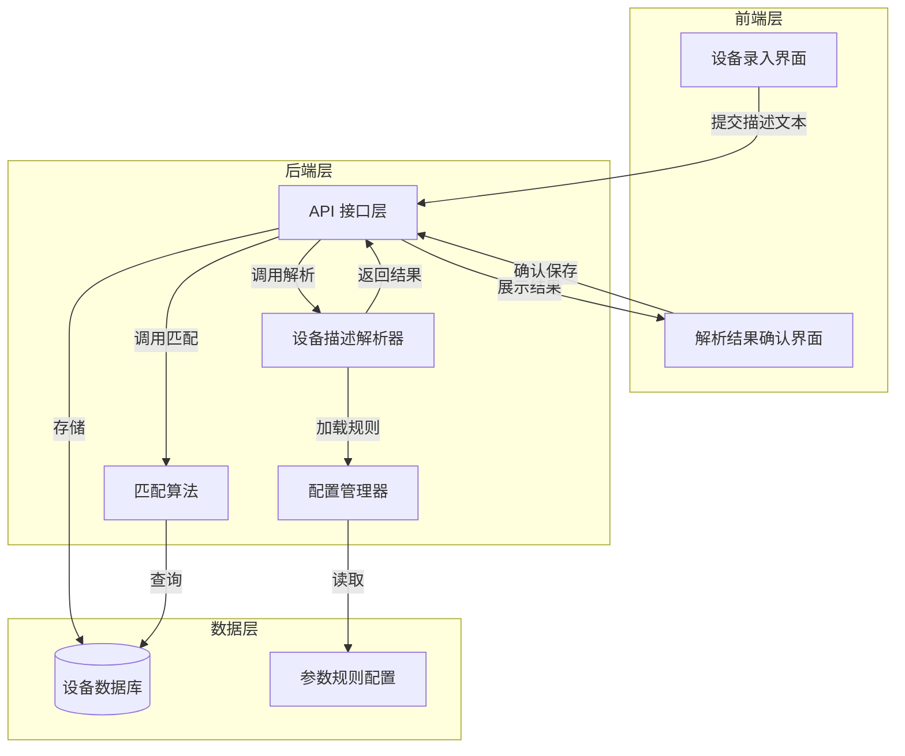
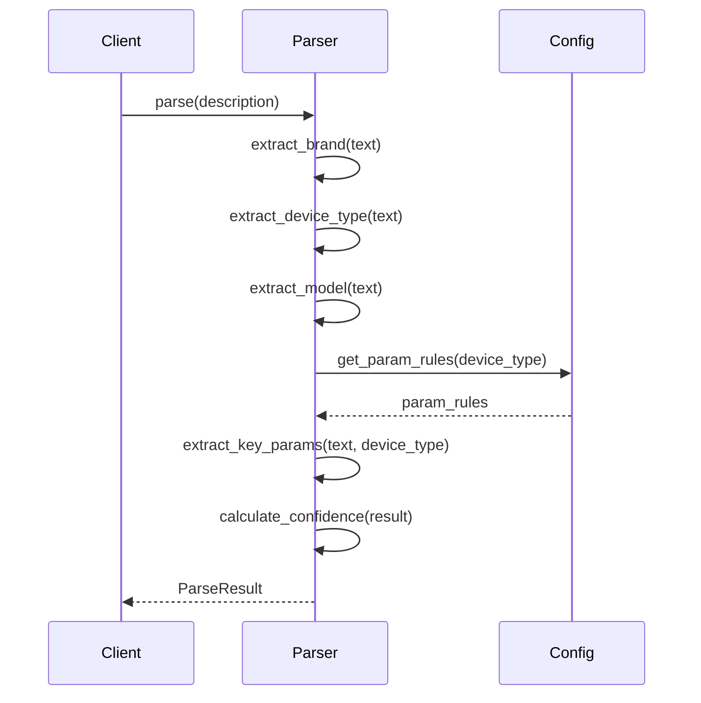

# 设计文档：智能设备录入系统

## 概述

智能设备录入系统通过自然语言处理技术，从自由文本中自动提取设备的结构化信息，包括品牌、设备类型、型号和关键参数。系统采用规则基础的解析方法，结合配置化的参数提取规则，为不同类型的设备提供定制化的信息提取能力。

### 核心功能

1. **智能解析**：从自由文本中提取品牌、设备类型、型号和关键参数
2. **置信度评估**：为解析结果提供可信度评分
3. **用户确认**：提供界面让用户审核和修正解析结果
4. **优化匹配**：基于设备类型和关键参数的加权匹配算法
5. **批量处理**：支持对现有设备数据的批量解析和迁移

### 设计原则

- **可配置性**：参数提取规则通过配置文件管理，易于扩展
- **向后兼容**：新的数据库结构保留现有字段，支持旧数据
- **渐进式增强**：用户可以选择智能解析或手动填写
- **数据完整性**：保留原始输入，允许重新解析
- **可测试性**：解析逻辑模块化，便于单元测试和属性测试

## 架构

### 系统架构图



### 分层架构

1. **表现层（Frontend）**
   - 设备录入表单
   - 解析结果确认界面
   - 匹配结果展示

2. **业务逻辑层（Backend）**
   - DeviceDescriptionParser：核心解析引擎
   - MatchingAlgorithm：设备匹配算法
   - ConfigurationManager：规则配置管理

3. **数据访问层（Data）**
   - 设备数据库操作
   - 配置文件读取

## 组件和接口

### 1. DeviceDescriptionParser（设备描述解析器）

核心解析引擎，负责从自由文本中提取结构化信息。

#### 接口定义

```python
class DeviceDescriptionParser:
    """设备描述解析器"""
    
    def __init__(self, config_manager: ConfigurationManager):
        """
        初始化解析器
        
        Args:
            config_manager: 配置管理器实例
        """
        pass
    
    def parse(self, description: str) -> ParseResult:
        """
        解析设备描述文本
        
        Args:
            description: 原始设备描述文本
            
        Returns:
            ParseResult: 包含品牌、设备类型、型号、关键参数和置信度的解析结果
        """
        pass
    
    def extract_brand(self, text: str) -> Optional[str]:
        """
        提取品牌信息
        
        Args:
            text: 输入文本
            
        Returns:
            品牌名称，如果未识别则返回 None
        """
        pass
    
    def extract_device_type(self, text: str) -> Optional[str]:
        """
        识别设备类型
        
        Args:
            text: 输入文本
            
        Returns:
            设备类型，如果未识别则返回 None
        """
        pass
    
    def extract_model(self, text: str) -> Optional[str]:
        """
        提取型号信息
        
        Args:
            text: 输入文本
            
        Returns:
            型号，如果未识别则返回 None
        """
        pass
    
    def extract_key_params(self, text: str, device_type: str) -> Dict[str, Any]:
        """
        根据设备类型提取关键参数
        
        Args:
            text: 输入文本
            device_type: 设备类型
            
        Returns:
            关键参数字典
        """
        pass
    
    def calculate_confidence(self, parse_result: ParseResult) -> float:
        """
        计算解析结果的置信度
        
        Args:
            parse_result: 解析结果
            
        Returns:
            置信度评分 (0.0 - 1.0)
        """
        pass
```

#### 解析流程



### 2. ConfigurationManager（配置管理器）

管理设备类型参数映射和参数识别规则。

#### 接口定义

```python
class ConfigurationManager:
    """配置管理器"""
    
    def __init__(self, config_path: str):
        """
        初始化配置管理器
        
        Args:
            config_path: 配置文件路径
        """
        pass
    
    def get_brand_keywords(self) -> Dict[str, List[str]]:
        """
        获取品牌关键词映射
        
        Returns:
            品牌名称到关键词列表的映射
        """
        pass
    
    def get_device_type_keywords(self) -> Dict[str, List[str]]:
        """
        获取设备类型关键词映射
        
        Returns:
            设备类型到关键词列表的映射
        """
        pass
    
    def get_param_rules(self, device_type: str) -> List[ParamRule]:
        """
        获取指定设备类型的参数提取规则
        
        Args:
            device_type: 设备类型
            
        Returns:
            参数规则列表
        """
        pass
    
    def reload(self) -> None:
        """重新加载配置文件"""
        pass
```

### 3. MatchingAlgorithm（匹配算法）

基于设备类型和关键参数的加权匹配算法。

#### 接口定义

```python
class MatchingAlgorithm:
    """设备匹配算法"""
    
    # 特征权重配置
    WEIGHTS = {
        'device_type': 30.0,
        'key_params': 15.0,
        'brand': 10.0,
        'model': 8.0,
        'description': 5.0
    }
    
    def find_similar_devices(
        self,
        target_device: Device,
        limit: int = 20
    ) -> List[MatchResult]:
        """
        查找相似设备
        
        Args:
            target_device: 目标设备
            limit: 返回结果数量限制
            
        Returns:
            匹配结果列表，按得分降序排列
        """
        pass
    
    def calculate_similarity(
        self,
        device1: Device,
        device2: Device
    ) -> float:
        """
        计算两个设备的相似度
        
        Args:
            device1: 设备1
            device2: 设备2
            
        Returns:
            相似度得分
        """
        pass
    
    def filter_by_device_type(
        self,
        device_type: str,
        candidates: List[Device]
    ) -> List[Device]:
        """
        按设备类型过滤候选设备
        
        Args:
            device_type: 目标设备类型
            candidates: 候选设备列表
            
        Returns:
            过滤后的设备列表
        """
        pass
```

### 4. API 接口层

提供 RESTful API 接口供前端调用。

#### 接口定义

```python
# POST /api/devices/parse
# 解析设备描述
{
    "description": "西门子 CO2传感器 QAA2061 量程0-2000ppm 输出4-20mA",
    "price": 1250.00
}

# Response
{
    "success": true,
    "data": {
        "brand": "西门子",
        "device_type": "CO2传感器",
        "model": "QAA2061",
        "key_params": {
            "量程": "0-2000ppm",
            "输出信号": "4-20mA"
        },
        "confidence_score": 0.92,
        "unrecognized_text": []
    }
}

# POST /api/devices
# 创建设备
{
    "raw_description": "西门子 CO2传感器 QAA2061 量程0-2000ppm 输出4-20mA",
    "brand": "西门子",
    "device_type": "CO2传感器",
    "model": "QAA2061",
    "key_params": {
        "量程": "0-2000ppm",
        "输出信号": "4-20mA"
    },
    "price": 1250.00,
    "confidence_score": 0.92
}

# Response
{
    "success": true,
    "data": {
        "id": 720,
        "created_at": "2024-01-15T10:30:00Z"
    }
}

# POST /api/devices/batch-parse
# 批量解析现有设备
{
    "device_ids": [1, 2, 3, 4, 5],  # 可选，不提供则处理所有设备
    "dry_run": false  # true 表示只测试不更新
}

# Response
{
    "success": true,
    "data": {
        "total": 719,
        "processed": 719,
        "successful": 650,
        "failed": 69,
        "success_rate": 0.904,
        "failed_devices": [
            {"id": 15, "error": "无法识别设备类型"},
            {"id": 42, "error": "缺少必填参数"}
        ]
    }
}

# GET /api/devices/{id}/similar
# 查找相似设备
# Response
{
    "success": true,
    "data": [
        {
            "device_id": 123,
            "similarity_score": 0.85,
            "matched_features": {
                "device_type": 30.0,
                "brand": 10.0,
                "key_params": 12.0
            },
            "device": {
                "brand": "西门子",
                "model": "QAA2061",
                "device_type": "CO2传感器"
            }
        }
    ]
}
```

## 数据模型

### 数据库结构变更

#### devices 表扩展

```sql
-- 添加新字段
ALTER TABLE devices ADD COLUMN raw_description TEXT;
ALTER TABLE devices ADD COLUMN key_params JSONB;
ALTER TABLE devices ADD COLUMN confidence_score FLOAT;

-- 创建索引
CREATE INDEX idx_devices_device_type ON devices(device_type);
CREATE INDEX idx_devices_brand ON devices(brand);
CREATE INDEX idx_devices_key_params ON devices USING GIN(key_params);
CREATE INDEX idx_devices_confidence_score ON devices(confidence_score);

-- 添加注释
COMMENT ON COLUMN devices.raw_description IS '用户输入的原始设备描述文本';
COMMENT ON COLUMN devices.key_params IS '根据设备类型提取的关键参数（JSON格式）';
COMMENT ON COLUMN devices.confidence_score IS '解析结果的置信度评分（0.0-1.0）';
```

#### 数据模型类

```python
from dataclasses import dataclass
from typing import Optional, Dict, Any, List
from datetime import datetime

@dataclass
class Device:
    """设备数据模型"""
    id: Optional[int]
    raw_description: str
    brand: Optional[str]
    device_type: Optional[str]
    model: Optional[str]
    key_params: Dict[str, Any]
    price: float
    confidence_score: float
    detailed_params: Optional[str]  # 保留旧字段
    created_at: Optional[datetime]
    updated_at: Optional[datetime]

@dataclass
class ParseResult:
    """解析结果数据模型"""
    brand: Optional[str]
    device_type: Optional[str]
    model: Optional[str]
    key_params: Dict[str, Any]
    confidence_score: float
    unrecognized_text: List[str]

@dataclass
class ParamRule:
    """参数提取规则"""
    param_name: str
    pattern: str  # 正则表达式
    required: bool
    data_type: str  # 'string', 'number', 'range'
    unit: Optional[str]

@dataclass
class MatchResult:
    """匹配结果"""
    device_id: int
    similarity_score: float
    matched_features: Dict[str, float]
    device: Device
```

### 配置文件结构

```yaml
# config/device_params.yaml

brands:
  西门子:
    keywords: ["西门子", "SIEMENS", "siemens"]
  霍尼韦尔:
    keywords: ["霍尼韦尔", "HONEYWELL", "honeywell"]
  施耐德:
    keywords: ["施耐德", "SCHNEIDER", "schneider"]

device_types:
  CO2传感器:
    keywords: ["CO2传感器", "二氧化碳传感器", "CO2 sensor"]
    params:
      - name: "量程"
        pattern: "量程[:：]?\\s*([0-9]+-[0-9]+\\s*ppm)"
        required: true
        data_type: "range"
        unit: "ppm"
      - name: "输出信号"
        pattern: "输出[:：]?\\s*([0-9]+-[0-9]+\\s*[mM][aA])"
        required: true
        data_type: "string"
        unit: "mA"
  
  座阀:
    keywords: ["座阀", "调节阀", "control valve"]
    params:
      - name: "通径"
        pattern: "DN\\s*([0-9]+)|通径[:：]?\\s*([0-9]+)"
        required: true
        data_type: "number"
        unit: "mm"
      - name: "压力等级"
        pattern: "PN\\s*([0-9]+)|压力[:：]?\\s*([0-9]+)"
        required: false
        data_type: "number"
        unit: "bar"

model_patterns:
  - pattern: "[A-Z]{2,}[0-9]{3,}"  # 如 QAA2061
  - pattern: "[A-Z]+-[0-9]+"       # 如 ABC-123
  - pattern: "[A-Z]+[0-9]+[A-Z]*"  # 如 VVF53
```

### 置信度计算规则

置信度评分基于以下因素：

```python
def calculate_confidence(parse_result: ParseResult) -> float:
    """
    计算置信度评分
    
    基础分: 0.5
    品牌识别: +0.15
    设备类型识别: +0.20
    型号识别: +0.10
    必填参数完整: +0.05 per param (最多 +0.15)
    
    Returns:
        0.0 - 1.0 之间的置信度评分
    """
    score = 0.5
    
    if parse_result.brand:
        score += 0.15
    
    if parse_result.device_type:
        score += 0.20
    
    if parse_result.model:
        score += 0.10
    
    # 检查必填参数
    required_params_found = count_required_params(parse_result)
    score += min(required_params_found * 0.05, 0.15)
    
    return min(score, 1.0)
```

## 正确性属性

*属性是一个特征或行为，应该在系统的所有有效执行中保持为真——本质上是关于系统应该做什么的形式化陈述。属性作为人类可读规范和机器可验证正确性保证之间的桥梁。*


### 核心解析属性

**属性 1：品牌识别一致性**

*对于任意* 包含配置中品牌关键词的设备描述文本，解析器应该能够识别出正确的品牌名称，并且支持品牌别名和拼写变体。

**验证：需求 1.1, 2.1, 2.4**

**属性 2：设备类型识别和规则应用**

*对于任意* 包含设备类型关键词的设备描述文本，解析器应该能够识别设备类型，并自动应用该类型对应的参数提取规则。

**验证：需求 1.2, 3.1, 3.2**

**属性 3：型号提取正确性**

*对于任意* 包含型号模式（字母+数字组合）的设备描述文本，解析器应该能够提取出型号信息，支持多种常见格式（如"QAA2061"、"ABC-123"等）。

**验证：需求 1.3, 4.1, 4.4**

**属性 4：设备类型特定参数提取**

*对于任意* 已识别设备类型的设备描述文本，解析器应该根据该设备类型的配置规则提取相应的关键参数（如传感器提取量程和输出信号，阀门提取通径和压力等级），并将结果存储为有效的JSON格式。

**验证：需求 1.4, 5.1, 5.2, 5.3, 5.4, 5.5**

**属性 5：原始文本保留**

*对于任意* 设备描述文本，解析后的结果应该保留完整的原始输入文本到 raw_description 字段，确保可以重新解析。

**验证：需求 1.6**

### 置信度评估属性

**属性 6：置信度范围约束**

*对于任意* 解析结果，计算的置信度评分应该在 0.0 到 1.0 之间（包含边界值）。

**验证：需求 1.5**

**属性 7：置信度与解析完整性相关性**

*对于任意* 解析结果，当缺少品牌、设备类型或必填参数时，置信度评分应该低于包含所有这些信息的解析结果的置信度评分。

**验证：需求 2.3, 3.3, 5.6, 7.7**

### 多候选选择属性

**属性 8：多品牌选择一致性**

*对于任意* 包含多个品牌关键词的设备描述文本，解析器应该选择一个最匹配的品牌（不返回多个品牌）。

**验证：需求 2.2**

**属性 9：多型号选择一致性**

*对于任意* 包含多个型号模式的设备描述文本，解析器应该选择一个最可能的型号（不返回多个型号）。

**验证：需求 4.2**

### 边界情况属性

**属性 10：无品牌文本处理**

*对于任意* 不包含任何配置品牌关键词的设备描述文本，解析器应该返回 None 作为品牌值。

**验证：需求 2.3**

**属性 11：无设备类型文本处理**

*对于任意* 不包含任何设备类型关键词的设备描述文本，解析器应该返回"未知类型"或 None。

**验证：需求 3.3**

**属性 12：无型号文本处理**

*对于任意* 不包含型号模式的设备描述文本，解析器应该返回 None 作为型号值。

**验证：需求 4.3**

### 未识别内容追踪属性

**属性 13：未识别文本记录**

*对于任意* 设备描述文本，解析器应该返回未能识别和分类的文本片段列表，允许用户查看哪些内容未被处理。

**验证：需求 7.4**

### 匹配算法属性

**属性 14：设备类型过滤优先**

*对于任意* 目标设备，匹配算法在查找相似设备时应该首先按设备类型过滤候选设备，只返回相同设备类型的匹配结果。

**验证：需求 9.1**

**属性 15：匹配结果排序和限制**

*对于任意* 目标设备，匹配算法应该返回最多20个候选设备，并且这些结果按相似度得分降序排列（得分高的在前）。

**验证：需求 9.6**

**属性 16：匹配结果包含详情**

*对于任意* 匹配结果，应该包含匹配的特征详情和各特征的得分，使用户能够理解为什么这些设备被认为相似。

**验证：需求 9.7**

### 批量处理属性

**属性 17：批量解析数据完整性**

*对于任意* 批量解析操作，如果某个设备的解析失败，该设备的原始数据应该保持不变，不应该被部分更新或损坏。

**验证：需求 10.5**

### 错误处理属性

**属性 18：错误信息具体性**

*对于任意* 导致解析失败或API调用失败的输入，系统应该返回具体的错误信息，明确指出失败的原因（而不是返回通用的"解析失败"消息）。

**验证：需求 11.7, 14.1**

**属性 19：错误分类正确性**

*对于任意* 系统错误，应该被正确分类为可恢复错误（如临时网络问题）或不可恢复错误（如数据格式错误），以便采取适当的处理策略。

**验证：需求 14.4**

**属性 20：错误时数据完整性保护**

*对于任意* 操作过程中发生的错误，系统应该确保现有数据库中的数据不被破坏或部分修改，保持数据的完整性和一致性。

**验证：需求 14.5**

## 错误处理

### 错误类型分类

系统定义以下错误类型：

#### 1. 验证错误（Validation Errors）- 可恢复

- **空输入错误**：用户提交空的设备描述
  - 错误码：`EMPTY_INPUT`
  - HTTP状态码：400
  - 处理：返回友好提示，要求用户输入设备描述

- **无效价格错误**：价格为负数或非数字
  - 错误码：`INVALID_PRICE`
  - HTTP状态码：400
  - 处理：返回错误信息，要求用户输入有效价格

#### 2. 解析错误（Parsing Errors）- 可恢复

- **低置信度警告**：解析成功但置信度低于阈值（如 < 0.5）
  - 错误码：`LOW_CONFIDENCE`
  - HTTP状态码：200（带警告）
  - 处理：返回解析结果，但标记为低置信度，建议用户检查

- **部分解析失败**：某些字段无法识别
  - 错误码：`PARTIAL_PARSE_FAILURE`
  - HTTP状态码：200（带警告）
  - 处理：返回已识别的字段，标记未识别的字段为空

#### 3. 配置错误（Configuration Errors）- 不可恢复

- **配置文件缺失**：无法加载参数规则配置
  - 错误码：`CONFIG_NOT_FOUND`
  - HTTP状态码：500
  - 处理：记录错误日志，返回服务不可用错误

- **配置格式错误**：配置文件格式不正确
  - 错误码：`INVALID_CONFIG`
  - HTTP状态码：500
  - 处理：记录错误日志，返回服务不可用错误

#### 4. 数据库错误（Database Errors）- 部分可恢复

- **连接失败**：无法连接到数据库
  - 错误码：`DB_CONNECTION_FAILED`
  - HTTP状态码：503
  - 处理：记录错误日志，返回服务暂时不可用，建议重试

- **查询失败**：数据库查询执行失败
  - 错误码：`DB_QUERY_FAILED`
  - HTTP状态码：500
  - 处理：记录错误日志和SQL语句，返回友好错误信息

- **数据完整性约束违反**：违反唯一性或外键约束
  - 错误码：`DB_CONSTRAINT_VIOLATION`
  - HTTP状态码：409
  - 处理：返回具体的约束违反信息

### 错误处理策略

```python
class ErrorHandler:
    """统一错误处理器"""
    
    @staticmethod
    def handle_validation_error(error: ValidationError) -> ErrorResponse:
        """处理验证错误"""
        return ErrorResponse(
            success=False,
            error_code=error.code,
            message=error.message,
            http_status=400,
            recoverable=True
        )
    
    @staticmethod
    def handle_parsing_error(error: ParsingError) -> ErrorResponse:
        """处理解析错误"""
        # 解析错误通常返回部分结果
        return ErrorResponse(
            success=True,
            warning=error.message,
            data=error.partial_result,
            http_status=200,
            recoverable=True
        )
    
    @staticmethod
    def handle_database_error(error: DatabaseError) -> ErrorResponse:
        """处理数据库错误"""
        # 记录详细错误日志
        logger.error(f"Database error: {error}", exc_info=True)
        
        # 返回友好的用户消息
        return ErrorResponse(
            success=False,
            error_code="DB_ERROR",
            message="数据库操作失败，请稍后重试",
            http_status=503 if error.is_connection_error else 500,
            recoverable=error.is_connection_error
        )
    
    @staticmethod
    def handle_config_error(error: ConfigError) -> ErrorResponse:
        """处理配置错误"""
        # 配置错误是严重错误，需要管理员介入
        logger.critical(f"Configuration error: {error}", exc_info=True)
        
        return ErrorResponse(
            success=False,
            error_code="CONFIG_ERROR",
            message="服务配置错误，请联系管理员",
            http_status=500,
            recoverable=False
        )
```

### 错误日志记录

所有错误都应该被记录，包含以下信息：

- 时间戳
- 错误类型和错误码
- 错误消息
- 堆栈跟踪（对于异常）
- 用户输入（脱敏后）
- 请求上下文（API端点、用户ID等）

```python
def log_error(error: Exception, context: Dict[str, Any]) -> None:
    """记录错误日志"""
    logger.error(
        f"Error occurred: {error.__class__.__name__}",
        extra={
            'error_type': error.__class__.__name__,
            'error_message': str(error),
            'context': sanitize_context(context),
            'timestamp': datetime.now().isoformat()
        },
        exc_info=True
    )
```

## 测试策略

### 双重测试方法

系统采用单元测试和属性测试相结合的方法，确保全面的测试覆盖：

- **单元测试**：验证特定示例、边界情况和错误条件
- **属性测试**：验证跨所有输入的通用属性

两者是互补的，都是全面覆盖所必需的。

### 单元测试策略

单元测试专注于：

1. **特定示例**：验证已知输入的正确行为
   - 示例：解析"西门子 CO2传感器 QAA2061 量程0-2000ppm 输出4-20mA"
   - 验证：品牌="西门子"，设备类型="CO2传感器"，型号="QAA2061"

2. **边界情况**：
   - 空输入
   - 极长的描述文本
   - 特殊字符和Unicode字符
   - 只包含价格没有描述

3. **错误条件**：
   - 数据库连接失败
   - 配置文件缺失
   - 无效的JSON格式

4. **集成点**：
   - API端点的请求/响应格式
   - 数据库操作的事务处理
   - 配置文件的加载和重载

### 属性测试策略

属性测试使用属性基础测试库（如Python的Hypothesis、JavaScript的fast-check）来验证通用属性。

#### 测试配置

- **最小迭代次数**：每个属性测试至少运行100次
- **标签格式**：`Feature: intelligent-device-input, Property {number}: {property_text}`
- **每个正确性属性必须由单个属性测试实现**

#### 属性测试示例

```python
from hypothesis import given, strategies as st
import pytest

# Feature: intelligent-device-input, Property 1: 品牌识别一致性
@given(
    brand=st.sampled_from(['西门子', '霍尼韦尔', '施耐德']),
    description=st.text(min_size=10, max_size=200)
)
def test_brand_recognition_consistency(parser, brand, description):
    """
    对于任意包含配置中品牌关键词的设备描述文本，
    解析器应该能够识别出正确的品牌名称
    """
    # 将品牌关键词插入描述中
    text_with_brand = f"{brand} {description}"
    
    result = parser.parse(text_with_brand)
    
    # 验证品牌被正确识别
    assert result.brand == brand or result.brand in get_brand_aliases(brand)

# Feature: intelligent-device-input, Property 6: 置信度范围约束
@given(description=st.text(min_size=1, max_size=500))
def test_confidence_score_range(parser, description):
    """
    对于任意解析结果，计算的置信度评分应该在 0.0 到 1.0 之间
    """
    result = parser.parse(description)
    
    assert 0.0 <= result.confidence_score <= 1.0

# Feature: intelligent-device-input, Property 14: 设备类型过滤优先
@given(
    device_type=st.sampled_from(['CO2传感器', '座阀', '温度传感器']),
    num_candidates=st.integers(min_value=30, max_value=100)
)
def test_device_type_filtering_priority(matcher, device_type, num_candidates):
    """
    对于任意目标设备，匹配算法应该首先按设备类型过滤候选设备
    """
    # 生成混合设备类型的候选设备
    candidates = generate_mixed_devices(num_candidates)
    target = Device(device_type=device_type, ...)
    
    results = matcher.find_similar_devices(target, candidates)
    
    # 验证所有返回的设备都是相同类型
    assert all(r.device.device_type == device_type for r in results)

# Feature: intelligent-device-input, Property 15: 匹配结果排序和限制
@given(
    num_candidates=st.integers(min_value=30, max_value=200)
)
def test_matching_results_sorted_and_limited(matcher, num_candidates):
    """
    对于任意目标设备，匹配算法应该返回最多20个候选设备，
    并且按相似度得分降序排列
    """
    candidates = generate_random_devices(num_candidates)
    target = generate_random_device()
    
    results = matcher.find_similar_devices(target, candidates)
    
    # 验证结果数量限制
    assert len(results) <= 20
    
    # 验证降序排列
    scores = [r.similarity_score for r in results]
    assert scores == sorted(scores, reverse=True)

# Feature: intelligent-device-input, Property 20: 错误时数据完整性保护
@given(
    device=st.builds(Device),
    error_type=st.sampled_from(['db_error', 'validation_error', 'parse_error'])
)
def test_data_integrity_on_error(db, device, error_type):
    """
    对于任意操作过程中发生的错误，
    系统应该确保现有数据不被破坏或部分修改
    """
    # 保存初始状态
    initial_data = db.get_all_devices()
    
    # 模拟错误
    with pytest.raises(Exception):
        if error_type == 'db_error':
            with mock_db_failure():
                save_device(device)
        elif error_type == 'validation_error':
            save_device(create_invalid_device())
        else:
            save_device(device_with_parse_error())
    
    # 验证数据未被修改
    current_data = db.get_all_devices()
    assert initial_data == current_data
```

### 测试数据生成策略

为了有效进行属性测试，需要生成多样化的测试数据：

```python
# 设备描述生成器
@st.composite
def device_description_strategy(draw):
    """生成随机设备描述"""
    brand = draw(st.sampled_from(['西门子', '霍尼韦尔', '施耐德', '']))
    device_type = draw(st.sampled_from(['CO2传感器', '座阀', '温度传感器', '']))
    model = draw(st.from_regex(r'[A-Z]{2,}[0-9]{3,}', fullmatch=True))
    
    params = []
    if device_type == 'CO2传感器':
        range_val = draw(st.integers(min_value=100, max_value=5000))
        params.append(f"量程0-{range_val}ppm")
        params.append("输出4-20mA")
    elif device_type == '座阀':
        dn = draw(st.integers(min_value=15, max_value=300))
        params.append(f"DN{dn}")
        pn = draw(st.integers(min_value=10, max_value=40))
        params.append(f"PN{pn}")
    
    parts = [p for p in [brand, device_type, model] + params if p]
    return ' '.join(parts)
```

### 测试覆盖目标

- **代码覆盖率**：至少85%的行覆盖率
- **分支覆盖率**：至少80%的分支覆盖率
- **属性测试**：每个正确性属性至少一个属性测试
- **单元测试**：每个公共方法至少一个单元测试
- **集成测试**：覆盖所有API端点

### 持续集成

所有测试应该在CI/CD流程中自动运行：

1. **提交前检查**：运行快速单元测试
2. **Pull Request检查**：运行完整测试套件（包括属性测试）
3. **部署前检查**：运行集成测试和端到端测试
4. **定期回归测试**：每日运行完整测试套件

### 测试环境

- **开发环境**：使用内存数据库（SQLite）进行快速测试
- **CI环境**：使用Docker容器化的PostgreSQL进行集成测试
- **测试数据**：使用工厂模式和Faker库生成测试数据
- **Mock策略**：对外部依赖（如第三方API）使用mock

## 实施阶段

### 阶段1：核心解析器和数据库（2-3周）

**目标**：建立基础架构和核心解析能力

- 数据库结构变更和迁移脚本
- ConfigurationManager实现
- DeviceDescriptionParser基础实现
- 品牌、设备类型、型号识别
- 基础参数提取规则
- 单元测试和属性测试

**交付物**：
- 数据库迁移脚本
- 核心解析器模块
- 配置文件模板
- 测试套件

### 阶段2：参数规则库和API（1-2周）

**目标**：完善参数提取能力和提供API接口

- 扩展设备类型参数映射
- 实现参数识别规则
- API接口实现（/parse, /devices）
- 置信度计算逻辑
- API测试

**交付物**：
- 完整的参数规则配置
- RESTful API接口
- API文档

### 阶段3：前端界面（2周）

**目标**：提供用户友好的录入和确认界面

- 设备录入表单
- 解析结果展示
- 编辑和确认功能
- 前端集成测试

**交付物**：
- 设备录入界面
- 解析结果确认界面
- 用户操作指南

### 阶段4：匹配优化（1周）

**目标**：提升设备匹配准确度

- 调整特征提取逻辑
- 优化权重分配
- 按设备类型过滤
- 匹配算法测试

**交付物**：
- 优化的匹配算法
- 匹配结果展示界面

### 阶段5：批量处理和优化（1-2周）

**目标**：支持现有数据迁移和性能优化

- 批量解析API实现
- 数据迁移工具
- 解析报告生成
- 性能优化
- 准确度评估

**交付物**：
- 批量处理脚本
- 数据迁移报告
- 性能优化报告

## 技术选型

### 后端技术栈

- **编程语言**：Python 3.9+
- **Web框架**：FastAPI（高性能、自动API文档）
- **数据库**：PostgreSQL 13+（支持JSONB）
- **ORM**：SQLAlchemy 2.0
- **配置管理**：PyYAML
- **测试框架**：
  - pytest（单元测试）
  - Hypothesis（属性测试）
  - pytest-asyncio（异步测试）

### 前端技术栈

- **框架**：React 18+ 或 Vue 3+
- **UI组件库**：Ant Design 或 Element Plus
- **状态管理**：Redux 或 Pinia
- **HTTP客户端**：Axios

### 开发工具

- **代码质量**：
  - Black（代码格式化）
  - Flake8（代码检查）
  - MyPy（类型检查）
- **文档**：
  - Swagger/OpenAPI（API文档）
  - Sphinx（代码文档）
- **版本控制**：Git
- **CI/CD**：GitHub Actions 或 GitLab CI

## 未来扩展方向

### 机器学习增强（可选）

当前设计使用规则基础的方法，未来可以考虑引入机器学习：

1. **命名实体识别（NER）**：使用NER模型识别品牌、型号等实体
2. **文本分类**：使用分类模型识别设备类型
3. **参数提取**：使用序列标注模型提取关键参数
4. **相似度学习**：使用深度学习模型计算设备相似度

### 用户反馈学习

收集用户修正的解析结果，用于：

1. 改进解析规则
2. 训练机器学习模型
3. 扩展品牌和设备类型词库
4. 优化置信度计算

### 多语言支持

扩展系统以支持多语言设备描述：

1. 英文设备描述解析
2. 多语言品牌名称映射
3. 国际化参数单位转换
